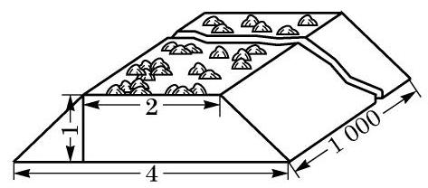
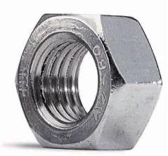

# 练习卡：练习 11.1(2)

1. 在修建铁路时, 路基需要用碎石铺垫. 已知路基的形状及尺寸如图所示 (单位: m),每修建 $1\mathrm{\;{km}}$ 铁路需要碎石多少 ${\mathrm{m}}^{3}$ ?

(第 1 题)

(第 3 题)

2. 一个圆柱形油桶的底面半径为 ${50}\mathrm{\;{cm}}$ ,高为 ${100}\mathrm{\;{cm}}$ . 求这个油桶的体积.

3. 如图, 查一查六角螺帽的尺寸规格, 并说明如何计算它的体积.
