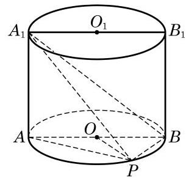
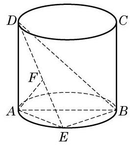
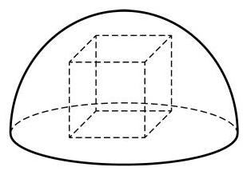

# 概念卡：B 组

1. 若一个长方体长、宽、高之比为 $2 : 1 : 3$ ,表面积为 22,求它的体积.

2. 如果两个球的体积之比为 8 : 27, 求这两个球的表面积之比.

3. 设点 ${O}_{1}$ 为圆锥的高靠近顶点的三等分点,求过 ${O}_{1}$ 与底面平行的截面面积与底面面积之比.

4. 若棱锥的高为 16 , 底面积为 256 , 平行于底面的截面面积为 50 , 求该截面与棱锥底面之间的距离.

5. 设圆锥的母线长为 1,高为 $\frac{1}{2}$ ,过圆锥的任意给定的两条母线作一个截面. 求截面面积的最大值.

6. 将若干毫升水倒入底面半径为 $2\mathrm{\;{cm}}$ 的圆柱形器皿中,量得水面高度为 $6\mathrm{\;{cm}}$ . 若将这些水倒入底面半径等于母线的倒圆锥形器皿中, 且恰好装满, 求圆锥形器皿的高.

7. 已知长方体 ${ABCD} - {A}_{1}{B}_{1}{C}_{1}{D}_{1}$ 的三条棱长分别为 $3\mathrm{\;{cm}}\text{ 、 }2\mathrm{\;{cm}}\text{ 、 }1\mathrm{\;{cm}}$ ,求表面有一只蜘蛛从 $A$ 爬行到 ${C}_{1}$ 的最短距离.

8. 如图,已知点 $P$ 在圆柱 ${O}_{1}O$ 的底面圆 $O$ 的圆周上, ${AB}$ 为圆 $O$ 的直径,圆柱的表面积为 ${20\pi },{OA} = 2,\angle {AOP} = {120}^{ \circ  }$ .

(1)求三棱锥 ${A}_{1} - {ABP}$ 的体积；

(2)求异面直线 ${A}_{1}B$ 与 ${AP}$ 所成角的大小.

(第 8 题)

(第 9 题)

(第 10 题)

9. 如图,在圆柱中,底面直径 ${AB}$ 等于母线 ${AD}$ ,点 $E$ 在底面的圆周上,且 ${AF} \bot \; {DE}, F$ 是垂足.

(1)求证: ${AF}\bot {DB}$ ；

(2)若圆柱与三棱锥 $D - {ABE}$ 的体积的比等于 ${3\pi }$ ，求直线 ${DE}$ 与平面 ${ABD}$ 所成角的大小.

10. 如图, 半球内有一内接正方体(即正方体的一个面在半球的底面圆上, 其余顶点在半球面上). 若正方体的棱长为 $\sqrt{6}$ ,求半球的表面积和体积.
