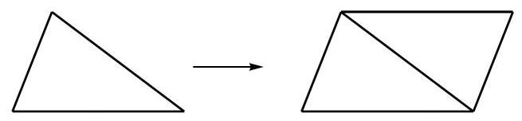
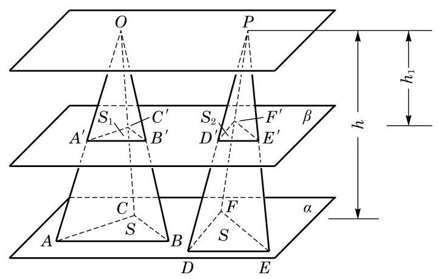
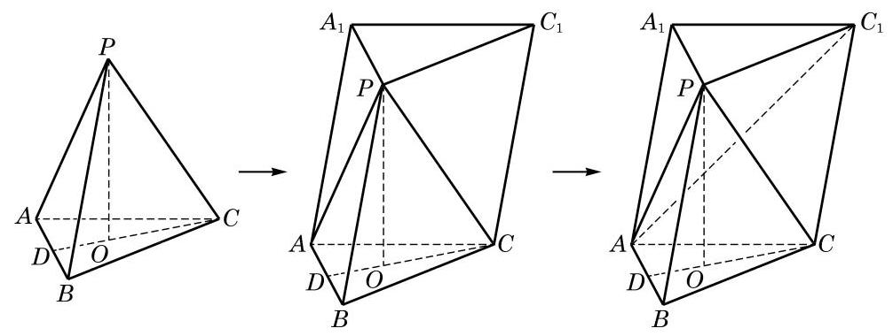
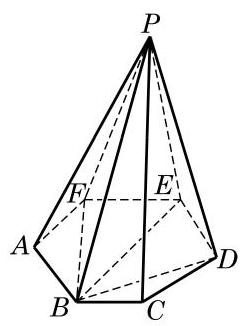

# 公式卡：探究与实践

下面我们尝试由棱柱的体积公式推导棱锥的体积公式.

平面几何中, 在推导三角形的面积公式时, 可以先把两个全等的三角形拼成一个平行四边形, 如图 11-2-9, 然后利用已知的平行四边形的面积公式导出三角形的面积公式.

前面我们已经得到了柱体的体积公式, 能否类似平面几何的做法, 利用柱体的体积公式来推导锥体的体积公式呢? 要这样做, 显然应该从三棱锥开始, 因为任意一个棱锥都可以分割为若干个三棱锥.

作为准备, 我们先证明: 等底等高的三棱锥的体积相等.

已知三棱锥 $O - {ABC}$ 和 $P - {DEF}$ 的底面积都是 $S$ ,高都是 $h$ .

求证: 三棱锥 $O - {ABC}$ 和 $P - {DEF}$ 的体积相等.

证明 如图 11-2-10,把两个三棱锥的底面都放在平面 $\alpha$ 上,任意作平面 $\beta$ 平行于 $\alpha$ , 设平面 $\beta$ 截三棱锥 $O - {ABC}$ 所得的截面为 $\bigtriangleup {A}^{\prime }{B}^{\prime }{C}^{\prime }$ ,其面积为 ${S}_{1}$ ; 平面 $\beta$ 截三棱锥 $P - {DEF}$ 所得的截面为 $\bigtriangleup  {D}^{\prime }{E}^{\prime }{F}^{\prime }$ ，其面积为 ${S}_{2}$ . 如果三棱锥的顶点 $O$ 和 $P$ 到平面 $\beta$ 的距离为 ${h}_{1}$ ,那么推得 $\frac{O{A}^{\prime }}{OA} = \frac{O{B}^{\prime }}{OB} = \frac{O{C}^{\prime }}{OC} = \frac{{h}_{1}}{h}$ 和 $\frac{{A}^{\prime }{B}^{\prime }}{AB} = \frac{{B}^{\prime }{C}^{\prime }}{BC} = \frac{{C}^{\prime }{A}^{\prime }}{CA} = \frac{{h}_{1}}{h}$ . 于是,得 $\bigtriangleup {A}^{\prime }{B}^{\prime }{C}^{\prime } \backsim \; \bigtriangleup {ABC}$ ,相似比是 $\frac{{h}_{1}}{h}$ . 同理可得 $\bigtriangleup {D}^{\prime }{E}^{\prime }{F}^{\prime }\varnothing \bigtriangleup {DEF}$ ,相似比也是 $\frac{{h}_{1}}{h}$ . 由相似形的性质, 得

$$
\frac{{S}_{1}}{S} = {\left( \frac{{h}_{1}}{h}\right) }^{2},\frac{{S}_{2}}{S} = {\left( \frac{{h}_{1}}{h}\right) }^{2},
$$

即

$$
{S}_{1} = {S}_{2} = {\left( \frac{{h}_{1}}{h}\right) }^{2}S.
$$

这说明用任意平行于底面的平面截两个等底的三棱锥时, 所得的截面面积相等, 所以由祖暅原理得三棱锥 $O - {ABC}$ 和 $P - {DEF}$ 的体积相等,即等底等高的三棱锥的体积相等.

下面我们来推导三棱锥的体积公式.

如图 11-2-11,设 $P - {ABC}$ 是任一给定的三棱锥,其底面面积为 $S,{PO}$ 为高,且 ${PO} = h$ . 过顶点 $P$ 分别作 $P{C}_{1}\overset{//}{ = }{BC}, P{A}_{1}\overset{//}{ = }{BA}$ ,连接 ${A}_{1}{C}_{1}\text{ 、 }{C}_{1}C\text{ 、 }{A}_{1}A$ ,显然 $\bigtriangleup {ABC}\overset{//}{ = } \; \bigtriangleup {A}_{1}P{C}_{1}$ . 由棱柱的定义,可知 ${A}_{1}P{C}_{1} - {ABC}$ 为三棱柱,其底面面积为 $S$ ,高为 $h$ . 下面需要研究的是三棱柱 ${A}_{1}P{C}_{1} - {ABC}$ 与三棱锥 $P - {ABC}$ 的体积之间的关系.

考察三棱柱的构造可以发现,比原三棱锥 $P - {ABC}$ 多出的部分是一个四棱锥 $P - {AC}{C}_{1}{A}_{1}$ . 连接 $A{C}_{1}$ ,将这个四棱锥分割成两个等底同高的三棱锥 $P - {AC}{C}_{1}$ 和 $P - A{C}_{1}{A}_{1}$ . 因此 ${V}_{\text{ 棱锥 }P - {AC}{C}_{1}} = {V}_{\text{ 棱锥 }P - A{C}_{1}{A}_{1}}$ . 另一方面,可将三棱锥 $P - A{C}_{1}{A}_{1}$ 视作三棱锥 $A - P{C}_{1}{A}_{1}$ ,则它和原三棱锥 $P - {ABC}$ 又是等底同高的三棱锥,于是 ${V}_{\text{ 棱锥 }P - {ABC}} = {V}_{\text{ 棱锥 }A - P{C}_{1}{A}_{1}} = \; {V}_{\text{ 棱锥 }P - A{C}_{1}{A}_{1}}$ . 我们证明了三个三棱锥 $P - {ABC}\text{ 、 }P - {AC}{C}_{1}$ 与 $P - A{C}_{1}{A}_{1}$ 都具有相同的体积, 于是

$$
{V}_{\text{ 棱柱 }{A}_{1}P{C}_{1} - {ABC}} = {V}_{\text{ 棱锥 }P - {ABC}} + {V}_{\text{ 棱锥 }P - {AC}{C}_{1}} + {V}_{\text{ 棱锥 }P - A{C}_{1}{A}_{1}}
$$

$$
= 3{V}_{\text{ 棱锥 }}{P}_{\text{ -ABC }}\text{ . }
$$

由此得 ${V}_{\text{ 棱锥P-ABC }} = \frac{1}{3}{Sh}$ .

由于任意棱锥都可以分割为若干个同高的三棱锥 (图 11-2-12), 因此可得棱锥的体积公式:

$$
{V}_{\text{ 棱锥 }} = \frac{1}{3}{Sh}.
$$

其中, $S$ 为棱锥的底面积, $h$ 为棱锥的高.
