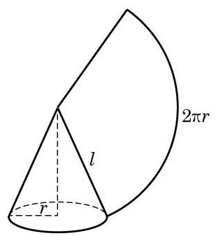

# 方法卡：3 锥体的表面积

与柱体类似, 锥体的表面积也等于侧面积与底面积之和. 对于棱锥或圆锥来说, 由于底面是一个平面多边形或一个圆, 可以用平面几何的方法计算面积, 因此求侧面积是关键. 对于一般的棱锥来说, 每个侧面都是三角形, 其侧面积也易于求出, 但难以写出一个一般的公式. 对于圆锥来说, 求其侧面积则是一个新的问题, 下面我们只讨论正棱锥和圆锥的表面积.

依据定义, 正棱锥的每个侧面都是全等的等腰三角形, 我们把这些等腰三角形底边上的高称为棱锥的斜高,记为 ${h}^{\prime }$ . 如果棱锥底面多边形的周长是 $c$ ,底面面积是 ${S}_{\text{ 底 }}$ ,那么容易求得棱锥的侧面积和表面积分别是:

$$
{S}_{\text{ 正棱锥侧 }} = \frac{1}{2}c{h}^{\prime },
$$

$$
{S}_{\text{ 止棱锥长 }} = \frac{1}{2}c{h}^{\prime } + {S}_{\text{ 底 }}\text{ . }
$$

对于圆锥, 我们可以采用求圆柱侧面积的方法, 将其沿一条母线剪开, 展开在一个平面内. 可以看到, 圆锥侧面的平面展开图是一个以圆锥母线 $l$ 为半径的扇形,扇形的弧长就等于圆锥底面的圆周长,如图 11-2-13 所示. 设圆锥的底面圆半径为 $r$ ,则扇形的中心角 $\theta  = \frac{2\pi r}{l}$ (弧度). 由扇形的面积公式,可得

$$
S\text{ 圆锥侧 } = {\pi rl}\text{ . }
$$

所以，圆锥的表面积公式为:

$$
{S}_{\text{ 圆锥表 }} = {\pi rl} + \pi {r}^{2}.
$$
