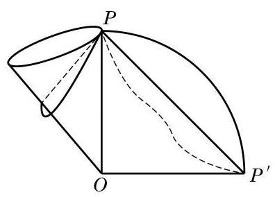

# 例题卡：例 7 有一个圆锥形漏斗,其底面直径是 ${10}\mathrm{\;{cm}}$ ,母线长为 ${20}\mathrm{\;{cm}}$ . 在漏斗口的点 $P$ 处用一根绳子将漏斗挂在墙面上,当绳子的长度最短时, 可以紧紧地箍住漏斗, 不会上下滑动. 求此时绳子的长度. (结果精确到 $1\mathrm{\;{cm}}$ )

例 7 有一个圆锥形漏斗,其底面直径是 ${10}\mathrm{\;{cm}}$ ,母线长为 ${20}\mathrm{\;{cm}}$ . 在漏斗口的点 $P$ 处用一根绳子将漏斗挂在墙面上,当绳子的长度最短时, 可以紧紧地箍住漏斗, 不会上下滑动. 求此时绳子的长度. (结果精确到 $1\mathrm{\;{cm}}$ )

解 如图 11-2-15,将圆锥侧面沿母线 ${OP}$ 展开,其平面展开图是一个以 $O$ 为圆心,半径为 ${20}\mathrm{\;{cm}}$ 的扇形. 此扇形的中心角 $\theta  = \frac{2\pi r}{l} = \frac{\pi }{2}$ (弧度),是一个直角扇形.

如果有一根绳子从点 $P$ 出发,绕漏斗侧面一周回到点 $P$ , 那么展开后这条绳子就变成平面上 $P$ 和 ${P}^{\prime }$ 两点之间的一条曲线. 因此,当这条曲线变成直线段 $P{P}^{\prime }$ 时,绳子的长度最短,其最短长度为 ${20}\sqrt{2} \approx  {28}\left( \mathrm{\;{cm}}\right)$ .
