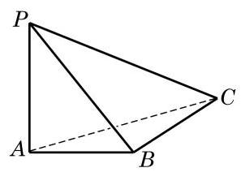
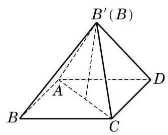

# 概念卡：A 组

1. 已知一个正三棱锥的底面边长为 6 , 侧棱长为 $\sqrt{15}$ . 求这个三棱锥的体积.

2. 如图,已知三棱锥 $P - {ABC}$ 中, ${PA}$ 垂直于平面 ${ABC},{AB} \bot  {BC},{PA} = 4,{AB} =$ 3, ${AC} = 5$ .

(1)求点 $A$ 到平面 ${PBC}$ 的距离；

(2)求三棱锥 $P - {ABC}$ 的表面积.

(第 2 题)

(第 3 题)

3. 把边长为 1 的正方形 ${ABCD}$ 沿对角线 ${AC}$ 折起,使 (折叠后的) $A\text{ 、 }{B}^{\prime }\text{ 、 }C\text{ 、 }D$ 四点为顶点的三棱锥体积最大. 求此三棱锥的表面积.

4. 棱锥被平行于底面的平面所截, 当截面分别平分棱锥的高与体积时, 相应的截面面积分别为 ${S}_{1}\text{ 、 }{S}_{2}$ . 求证: ${S}_{1} < {S}_{2}$ .

5. 若圆锥的底面半径为 1,高为 $\sqrt{3}$ ,求圆锥的表面积.

6. 把一个圆锥截成圆台,已知圆台的上、下底面半径的比为 $1 : 4$ ,母线 (原圆锥母线在圆台中的部分) 长为 ${10}\mathrm{\;{cm}}$ . 求原圆锥的母线长.

7. 已知圆锥的底面半径为 3,沿该圆锥的母线把侧面展开后可得到圆心角为 $\frac{2\pi }{3}$ 的扇形. 求该圆锥的高.

8. 用一个平面去截正方体, 得到一个三棱锥, 截得的三棱锥中, 除了截面外另三个面的面积分别为 ${S}_{1}\text{ 、 }{S}_{2}\text{ 、 }{S}_{3}$ . 求这个三棱锥的体积.
