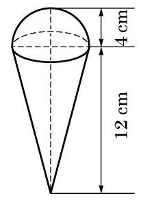
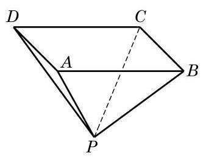
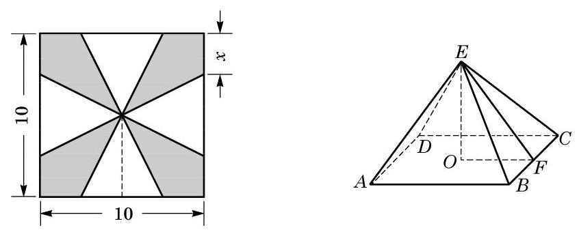

# 概念卡：拓展与思考

1. 已知圆锥的底面半径为 $r$ ,高为 $h$ ,正方体 ${ABCD} - {A}_{1}{B}_{1}{C}_{1}{D}_{1}$ 内接于该圆锥. 求这个正方体的棱长.

2. 如图, 一个圆锥形的空杯子上放着一个半球形的冰激凌, 如果冰激凌融化了, 会溢出来吗?

(第 2 题)

(第 3 题)

3. 如图,用一块钢锭浇铸一个厚度均匀,且表面积为 $2{\mathrm{\;m}}^{2}$ 的正四棱锥形有盖容器. 设容器的高为 $h\mathrm{\;m}$ ,盖子的边长为 $a\mathrm{\;m}$ .

(1)求 $a$ 关于 $h$ 的函数表达式；

(2)当 $h$ 为何值时,容器的容积 $V$ 最大? 并求出 $V$ 的最大值.

4. 将一块边长为 ${10}\mathrm{\;{cm}}$ 的正方形铁片裁下如图所示的阴影部分，用余下的四个全等的等腰三角形加工成一个无盖的正四棱锥形容器罩.

(1)试把容器罩的表面积 $S$ 表示为 $x$ 的函数;

(2)试把容器罩的体积 $V$ 表示为 $x$ 的函数.

(第 4 题)
