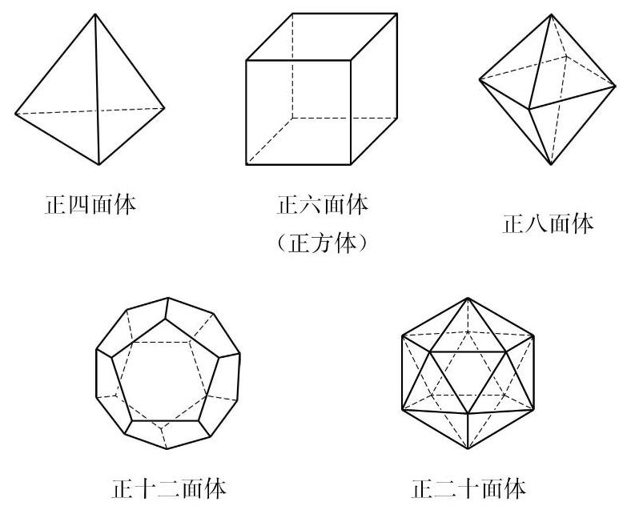

# 定理卡：1 多面体

在 11.1 节中, 我们把多面体定义为由三角形或平面多边形围成的封闭几何体, 我们还知道了棱柱、棱锥、棱台等几何体都是多面体. 本节将从多面体中面的数量和特点这个不同角度对多面体做一些探讨.

多面体可以用它的面的数量进行命名，有几个面的多面体就叫做几面体. 例如, 三棱锥有一个底面和三个侧面, 所以是四面体; 长方体 (四棱柱) 有六个面,是六面体. 一般地,一个 $n$ 棱锥有一个底面和 $n$ 个侧面,所以是 $n + 1$ 面体; $n$ 棱柱或 $n$ 棱台有两个底面和 $n$ 个侧面,所以是 $n + 2$ 面体.

容易看出, 一个多面体至少有四个面. 这是因为, 如果在一个多面体中任意选定一个面, 那么这个面至少有三条边, 即它的边界上至少有多面体的三条棱. 每条棱还是这个面与另一个面的交线, 于是得到了另外三个面. 这三个面互不重合, 否则有一个面与预先选定的面有两条公共棱, 从而与选定的面重合, 这是不可能的. 于是, 我们至少在这个多面体上找到了四个面.

由此可见, 面数最少的多面体是四面体, 即三棱锥. 四面体在立体几何中的作用相当于三角形在平面几何中的作用. 例如, 平面上的多边形都可以由三角形拼合而成, 而空间中的多面体都可以由四面体拼合而成.

与平面上的正多边形类似, 在空间中可以考虑正多面体. 如果一个多面体的所有面都是全等的正三角形或正多边形, 每个顶点聚集的棱的条数都相等, 这个多面体就叫做正多面体 (regular polyhedron). 图 11-3-1 给出了五种不同的正多面体. 事实上， 用本节“课后阅读”中所介绍多面体的欧拉定理, 可以验证只有这五种正多面体.

---

正多面体又称为柏拉图立体 (platonic solid), 因古希腊哲学家柏拉图(Plato，公元前 427-公元前 347) 对它们所做的研究而得名.

---

