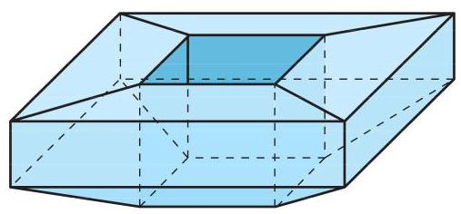
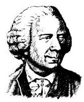

# 定理卡：多面体的欧拉定理

多面体的世界是丰富多彩的, 但会遵循一些非常简单的基本规律, 多面体的欧拉定理就描述了这样一个规律.

多面体的欧拉定理: 简单多面体的顶点数 $V$ 、棱数 $E$ 与面数 $F$ 有关系

$$
V + F - E = 2.
$$

这里首先要知道什么是“简单多面体”. 要弄清这个概念, 设想多面体的面都是用具有良好弹性的橡胶做成的. 如果往这个多面体充足够多的气体以后能够使这个多面体膨胀成一个球体, 那么这个多面体就是一个简单多面体.

我们迄今所见的多面体(如棱柱、棱锥、正多面体等)都是简单多面体. 但要构造一个非简单多面体也不难. 如图 11-3-4, 这是一个中间有一个长方体空洞的十六面体, 往这样的橡胶多面体充气，得到的是一个游泳圈，而不是球. 算一算，对于图 11-3-4 的多面体, $V + F - E$ 等于多少.

多面体的欧拉定理的证明与中学数学教材中常见的几何证明有着本质的不同, 它设想所讨论的多面体是用一种可随意变形但不会撕破或粘连的材料(如橡胶)做成的，于是可以把它拉伸或压缩，转换为一个能更好把握的几何体进行研究. 这里我们不做深入讨论, 但要指出, 这个定理及其证明实际上归入一个新的几何学一一拓扑学的领域. 拓扑学关注的是 “相邻” 状态与 “连续” 变形, 而不是度量 (长度、角度以及派生的面积、体积等), 因此拓扑学常被人戏称为 “橡皮筋上的几何学”.

欧拉 (L. Euler, 1707 — 1783), 瑞士数学家，是科学史上最多产的一位杰出数学家， 在许多领域都作出了奠基性的贡献.

多面体的欧拉定理及其推广是拓扑学中的重要定理, 其所揭示的“欧拉示性数”已成为拓扑学的基础概念.

有了多面体的欧拉定理,再对正多面体的顶点数 $V$ 、棱数 $E$ 、面数 $F$ 以及每面的边数和每顶点聚集的棱数之间的关系做一些分析, 就可以证明正多面体只有图 11-3-1 所示的 5 种, 有兴趣的同学不妨一试. 正多面体的相关数据如表 11-1 所示:

表 11-1
