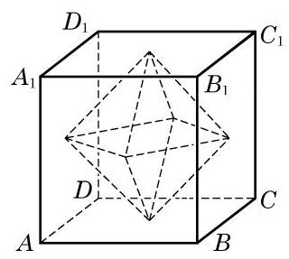
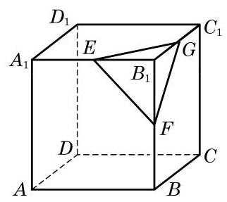
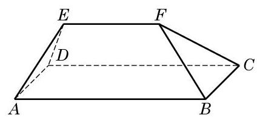

# 方法卡：A 组

1. 如图,以正方体 ${ABCD} - {A}_{1}{B}_{1}{C}_{1}{D}_{1}$ 六个面的中心为顶点所构成的多面体有多少条棱和多少个面? 设正方体的棱长为 1,设个多面体的表面积和体积是多少?

(第 1 题)

(第 2 题)

2. 如图,设 $E\text{ 、 }F\text{ 、 }G$ 分别是正方体 ${ABCD} - {A}_{1}{B}_{1}{C}_{1}{D}_{1}$ 的共点的三条棱 ${A}_{1}{B}_{1}$ 、 ${B}_{1}B\text{ 、 }{B}_{1}{C}_{1}$ 的中点,过这三个点的平面截正方体得到的一个“角”是四面体 ${B}_{1}{EFG}$ . 设正方体的棱长为 1 .

(1)求证:四面体 ${B}_{1}{EFG}$ 是以 ${B}_{1}$ 为顶点、以 ${EFG}$ 为底面的正三棱锥；

(2)在四面体 ${B}_{1}{EFG}$ 中，求顶点 ${B}_{1}$ 到底面 ${EFG}$ 的距离；

(3)如果将正方体按照题设的方法截去八个“角”，那么剩余的多面体有几个顶点、几条棱、几个面? 并求这个剩余多面体的表面积与体积.

3. 在如图所示的多面体中, 已知 ABCD 为矩形, ${ABFE}$ 和 ${DCFE}$ 为全等的等腰梯形, ${AB} = 4,{BC} = {AE} = \; {EF} = 2$ . 求此多面体的表面积与体积.

(第 3 题)

4. 一个直角三角形有一个 $\frac{\pi }{6}$ 的内角,这个内角所对直角边的长度为 1 . 把这个三角形绕其斜边旋转一周, 求所得旋转体的表面积与体积.
