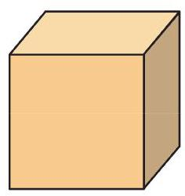
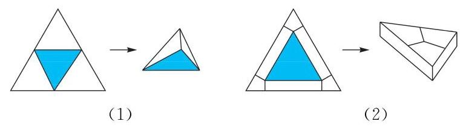

# 方法卡：B 组

(第 1 题)

1. 如图, 给定一个正方体形状的土豆块, 只切一刀, 可以得到下面哪些类型的多面体?

① 四面体; ② 四棱锥; ③ 四棱柱;

④ 五棱锥; ⑤ 五棱柱; ⑥ 六棱锥；

⑦ 七面体.

___(找出可能的结果，并将序号填在横线上)

2. 如图, 有两张全等的正三角形纸片, 按照下面两种方法分别将它们剪拼成一个三棱锥和一个三棱柱. 试比较这两个多面体的体积的大小.

(第 2 题)
