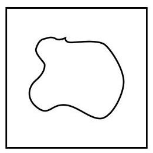

# 方法卡：课后阅读

##### 概率、经验概率与主观概率

概率是赋予事件的一个数, 它表达该事件有多大的可能性发生. 在等可能的假设下, 抛掷一枚硬币得正面的概率是 $\frac{1}{2}$ , 掷一颗骰子得点数 6 的概率是 $\frac{1}{6}$ . 但是,如果没有等可能假设, 这些概率是很难知道的. 例如, 假设抛掷的一枚硬币由一个金属薄片和一个木质薄片贴合而成,这样的硬币显然不再是等可能的,抛掷这枚硬币金属面朝上的概率 $p$ 和木质面朝上的概率 $q$ 依然是存在的,且 $p + q = 1$ ,但理论上没有人能够算出来 $p$ 与 $q$ 究竟是多少. 这时候因试验可以任意多次重复, 我们仍可以用频率或者经验概率来进行估计, 这正是大数定律所断言的.

现在换个问题. 假设小明今年 20 岁, 能够健康活到 70 岁的可能性有多大? 因为不能预测, 健康活到 70 岁是一个随机事件. 它有没有一个概率呢? 因为小明的一生是不能重复的, 大数定律失效. 这时即使说概率, 也只是一种心理预期, 无法加以检验. 这是作为数学的概率论无法解决的问题, 称之为主观概率, 它只能反映说话者的主观判断.

尽管小明对自己能健康活到 70 岁的可能性的判断在数学上没有意义, 但我们仍然可以做一点有意义的事情，就是把其他人看成是小明的某种重复，从而求得这个事件的"频率", 也就是求健康活到 70 岁的人数在总人数中的比例. 这个比例是统计数据, 对具体的个人而言是没有意义的，但是它仍然有其统计意义，在某些场合是非常有用的. 例如，保险公司可以据此来计算人寿保险的保险费率.

从这里可以明白, 生活中经常说的话, 如 "学某某专业容易找工作"或 "锻炼让人长寿" 等, 都是统计意义上的断言, 对具体个人没有特别的意义.

##### 蒙特卡洛算法

大数定律还给我们提供了一种新的算法, 称为蒙特卡洛算法 (Monte Carlo algorithm). 假设我们要算平面上一个不规则区域 $D$ (如某个国家在地图上所占的区域)的面积，这样的图形用通常的面积计算方法是不容易求得的.

怎么应用蒙特卡洛算法呢? 看一个简单的例子. 首先, 取一块正方形纸板, 将其表面正方形记作 $\Omega$ ,把所求的区域 $D$ 放在此正方形纸板中,如图 12-3-1 所示.

然后,把这块包含区域 $D$ 的正方形纸板放置在墙上,向它随意投掷 200 次飞镖,记录飞镖落在 $D$ 中的次数有 82 次.

因为是随机投掷飞镖,所以飞镖落在 $D$ 中的概率等于面积比,即

$$
p = \frac{\left| D\right| }{\left| \Omega \right| },
$$

其中 $\left| D\right|$ 与 $\left| \Omega \right|$ 分别表示两个区域的面积 (这是另一种古典概率,称为几何概率模型). 现在飞镖落在 $D$ 中的频率为

$$
\widehat{p} = \frac{82}{200} = \frac{41}{100}.
$$

按大数定律,应有 $\widehat{p} \approx  p$ ,因此

$$
\left| D\right|  \approx  \frac{41}{100}\left| \Omega \right|
$$

其中正方形 $\Omega$ 的面积已知或者是容易计算的.

上面例子中所示的方法就是蒙特卡洛算法, 也称为随机化算法. 该算法的优点是操作简单, 但缺点是难以估计和控制误差. 法国数学家蒲丰(G. -L. L. de Buffon)在 1777 年曾经设计过投针实验来计算圆周率 $\pi$ 的近似值,相关内容留作课外实践.
