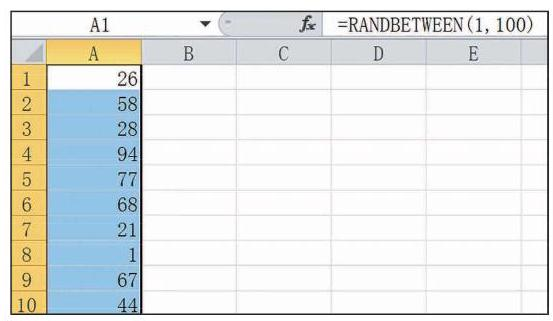

# 概念卡：信息技术:利用计算机或计算器产生随机数

利用计算机中的电子表格办公软件可以方便地产生所需要的随机数. 在空白单元格内输入随机函数 “ = RANDBETWEEN $\left( {m, n}\right)$ ” $\left( {m < n}\right)$ ，运行一次，就能得到一个 $m \sim  n$ 之间的随机整数, 利用软件的自动填充功能, 拖拽该单元格的填充柄, 便可以得到多个 $m \sim  n$ 之间的随机整数. 图 13-3-2 即是通过输入随机函数“=RANDBETWEEN(1,100)”所产生的 1 ~ 100 之间的随机整数.

利用计算器也可以帮助我们生成随机数. 一般计算器内部都有一个随机函数 “RAND”，它可以产生 0~1 的随机数.

---

注意，利用计算机或计算器产生的随机数实际上是伪随机数, 因为它们是由确定的过程所产生的, 尽管这个过程可能很复杂.

---
