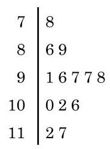

# 概念卡：2 茎叶图

频率分布直方图并不是展示数据分布的唯一选择. 在数据不多的情况下, 我们可以绘制茎叶图 (stem-and-leaf plot), 展示所有样本数据的信息.

例如,某个品种的小麦麦穗长度 (单位: $\mathrm{{cm}}$ ) 的样本数据如下所示, 如何分析该品种小麦的麦穗长度的分布情况呢?

10.2 9.7 7.8 10.0 9.1 8.9 8.6

9.8 9.6 9.7 11.2 10.6 11.7

在上述问题中, 我们将样本数据分为茎和叶两个部分: 整数部分作为“茎”，小数作为“叶”. 对于第一个麦穗长度数据 10.2 来说, 10 是茎, 2 则是叶. 然后把 “茎”由小到大、从上往下写成一列, 并在其左边或右边画一条竖直的线 (不妨画在右边). 最后把 “叶”写在它所属的“茎”的右边，由小到大排成一行. 这样就得到该品种麦穗长度的茎叶图(图 13-4-4).

解读茎叶图和解读直方图一样, 要注意整体形态. 从这张图可以直观地看出该品种的麦穗的长度主要集中在 $9 \sim  {10}\mathrm{\;{cm}}$ 之间, 并且分布比较对称.

茎叶图既可以用于呈现单组数据, 也可以用于对两组同类数据的比较分析.
