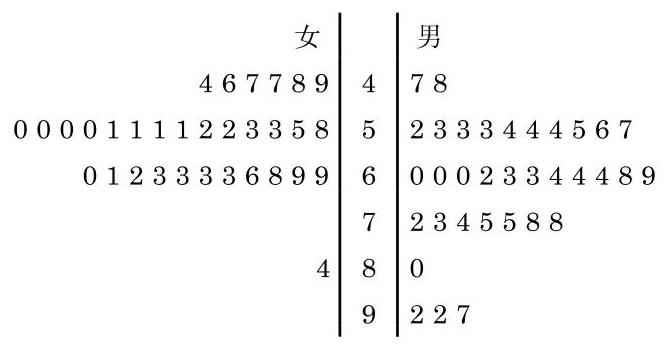

# 例题卡：例 1 根据表 13-2 中的数据, 分别绘制女生和男生的体重分布茎叶图, 并比较女生和男生的体重分布.

例 1 根据表 13-2 中的数据, 分别绘制女生和男生的体重分布茎叶图, 并比较女生和男生的体重分布.

解 因为表 13-2 中的数据不是很多, 而且学生的体重都是两位数, 所以可以比较方便地绘制茎叶图. 我们把表示体重的两位数的十位数字作为“茎”，从小到大排列在中间，男女生体重的个位数字作为 “叶” 分列在两边，以便于比较，就得到下面的茎叶图(图 13-4-5): 9

图 13-4-5 A 校 66 名高一年级学生体重的茎叶图

在图 13-4-5 中,“茎”为 4 的男生有体重为 ${47}\mathrm{\;{kg}}$ 和 ${48}\mathrm{\;{kg}}$ 两位, “叶”中就有 7、8 两个数字, 其余类同.

从图中可以看出, 女生的体重整体上低于男生的体重. 此外，女生的体重分布集中程度较高，男生的体重分布相对分散一些.

用茎叶图展示数据的优点在于所有信息都可以从茎叶图中得到, 由茎叶图也很容易制作相应的频率分布表和频率分布直方图.

---

直方图如何分组没有绝对的标准, 但茎叶图的分组却要加以注意. “茎”视实际需要可以是任何位数, 而“叶”只能是一位数. 当数据的位数较多时, 选择“茎”以后，“叶” 也可以通过四舍五入取值.

---
