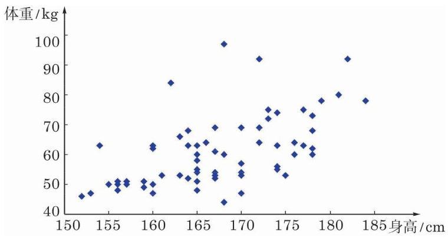

# 概念卡：3 散点图

仍以本节开始的 A 校 66 名高一年级学生为例, 表 13-2 中学生的每一个身高值都对应一个体重值. 经验认为, 人的体重和身高有一定的相关性, 身材较高的人往往体重也较重, 对于高一年级学生群体, 客观数据是否支持这种说法呢? 从表 13-2 中我们无法直观地看出. 为了清楚地看到这一点, 可以绘制散点图.

在考虑两组数据时, 为了对两组数据之间的关系形成大致的了解, 通常将这两组数据所对应的点描在平面直角坐标系内, 这些点组成的统计图称为散点图 (scatter diagram).

我们把表 13-2 中学生的身高作为横坐标, 体重作为纵坐标, 在直角坐标系中绘制出相应的点, 就得到了身高和体重的散点图 (图 13-4-6).

图 13-4-6 A 校 66 名高一年级学生身高、体重散点图

从图 13-4-6 中可以直观地看出, 图中的点从左至右大致是逐渐上升的, 也就是说, “身材较高的人, 体重往往也较重”这一说法在高一年级学生群体中就总体而言是对的.
