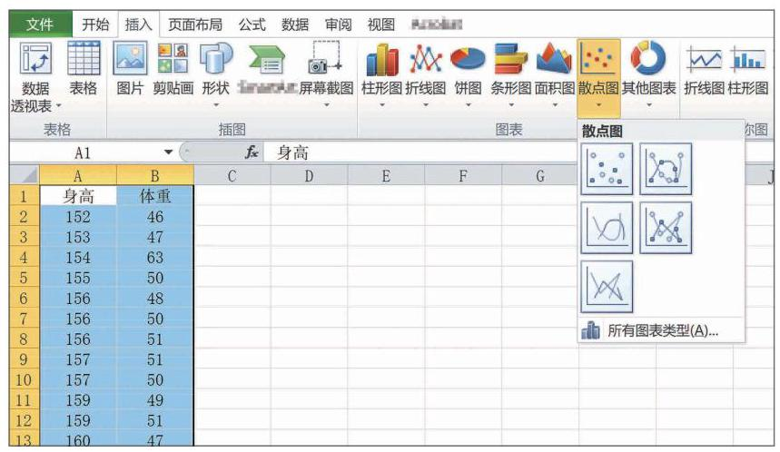

# 概念卡：信息技术:绘制统计图表

运用计算机中的电子表格办公软件可以绘制多种统计图表. 尽管不同版本的处理细节略有不同，但基本过程类似. 严格来说, 它们并不是统计软件, 但作为办公软件, 具有一定的统计计算功能，并且可以实施简单的数据统计、图表绘制等操作. 要做更复杂、更专业的统计工作，软件市场上有比较成熟的统计分析软件, 可供选用.

下面以表 13-2 的数据为例, 绘制散点图.

(1)在工作簿中输入身高和对应体重的两列或两行数据.

(2)选中这两列或两行数据，在“插入”菜单中选择所需要的图像类型——散点图；根据需要选择其中一种散点图的类型并单击(图 13-4-8)，一幅散点图即出现在工作簿中.

(3)根据需要选择坐标轴的范围以及单位长度等，使得统计图具有较好的可视性. 例如, 横坐标身高的范围可以取 [150,185), 纵坐标体重的范围可以取 [40,100), 修改后就得到了图 13-4-6.
