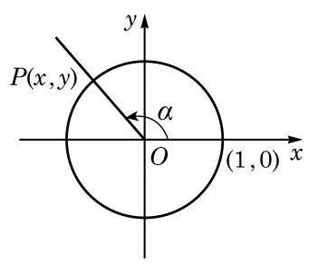
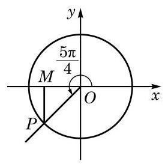

# 例题卡：例 10 求角 $\frac{5\pi }{4}$ 的正弦、余弦和正切值. 则角 $\alpha$ 的终边与以原点为圆心的单位圆交于唯一的一点 $P\left( {x, y}\right)$ , 如图 6-1-9 所示. 这样,任意一个角 $\alpha$ 对应于单位圆上一点 $P$ ; 反之,单位圆上一点 $P$ 可对应无穷多个角,但这些角的弧度数之差必为 ${2\pi }$ 的整数倍. 由定义可知, $x = \cos \alpha , y = \sin \alpha$ . 因此, 单位圆上点 $P$ 的坐标必可以写为 $\left( {\cos \alpha ,\sin \alpha }\right)$ .

例 10 求角 $\frac{5\pi }{4}$ 的正弦、余弦和正切值. 则角 $\alpha$ 的终边与以原点为圆心的单位圆交于唯一的一点 $P\left( {x, y}\right)$ , 如图 6-1-9 所示. 这样,任意一个角 $\alpha$ 对应于单位圆上一点 $P$ ; 反之,单位圆上一点 $P$ 可对应无穷多个角,但这些角的弧度数之差必为 ${2\pi }$ 的整数倍. 由定义可知, $x = \cos \alpha , y = \sin \alpha$ . 因此, 单位圆上点 $P$ 的坐标必可以写为 $\left( {\cos \alpha ,\sin \alpha }\right)$ .

解 设角 $\frac{5\pi }{4}$ 的终边交以原点为圆心的单位圆于点 $P$ ,过点 $P$ 作 $x$ 轴的垂线,其垂足为 $M$ ,如图 6-1-10 所示. 在直角三角形 ${OMP}$ 中, $\angle {MOP} = \frac{\pi }{4}$ ,由此可得 $\left| {OM}\right|  = \frac{\sqrt{2}}{2},\left| {MP}\right|  = \frac{\sqrt{2}}{2}$ ,所以点 $P$ 的坐标为 $\left( {-\frac{\sqrt{2}}{2}, - \frac{\sqrt{2}}{2}}\right)$ . 于是, $\sin \frac{5\pi }{4} =  - \frac{\sqrt{2}}{2},\cos \frac{5\pi }{4} = \; - \frac{\sqrt{2}}{2}$ ,而 $\tan \frac{5\pi }{4} = 1$ .

对终边与坐标轴重合的角 $\alpha$ ,设终边与以原点为圆心的单位圆的交点为 $P$ ,请同学们完成以下表格 (表 6-4).

表 6-4
