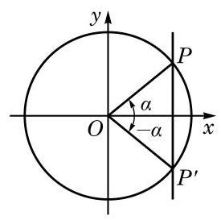
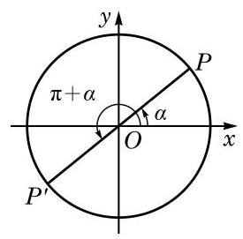
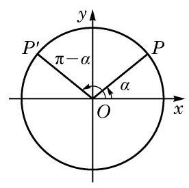

# 方法卡：4 诱导公式

${2k\pi } + \alpha \left( {k \in  \mathbf{Z}}\right) , - \alpha ,\pi  \pm  \alpha ,\frac{\pi }{2} \pm  \alpha$ 这些角都与角 $\alpha$ 有特殊的关系. 已知角 $\alpha$ 的正弦、余弦、正切及余切值,能否快速给出上述这些角的正弦、余弦、正切及余切值？这就是诱导公式要解决的问题.

由于角 ${2k\pi } + \alpha \left( {k \in  \mathbf{Z}}\right)$ 的终边与角 $\alpha$ 的终边重合,因此由定义有如下诱导公式:

$\tan \left( {{2k\pi } + \alpha }\right)  = \tan \alpha ,\;\cot \left( {{2k\pi } + \alpha }\right)  = \cot \alpha \left( {k \in  \mathbf{Z}}\right) .$

由这组诱导公式, 求任意角的正弦、余弦、正切及余切值可以转化为求 $\lbrack 0,{2\pi })$ 范围内一个角的相应值.

角 $\alpha$ 的终边与角 $- \alpha$ 的终边关于 $x$ 轴对称(图 6-1-11)，角 $\alpha$ 的终边与单位圆交于点 $P\left( {\cos \alpha ,\sin \alpha }\right)$ ,而角 $- \alpha$ 的终边与单位圆交于点 ${P}^{\prime }\left( {\cos \left( {-\alpha }\right) ,\sin \left( {-\alpha }\right) }\right)$ . 由于点 $P$ 与点 ${P}^{\prime }$ 关于 $x$ 轴对称, 其横坐标相等, 而纵坐标互为相反数, 因此有如下诱导公式:

$$
\sin \left( {-\alpha }\right)  =  - \sin \alpha ,\;\cos \left( {-\alpha }\right)  = \cos \alpha ,
$$

$$
\tan \left( {-\alpha }\right)  =  - \tan \alpha ,\;\cot \left( {-\alpha }\right)  =  - \cot \alpha .
$$

由这组诱导公式, 求负角的正弦、余弦、正切及余切值可以转化为求正角的相应值.

将角 $\alpha$ 的终边绕着原点 $O$ 按逆时针方向旋转 $\pi$ 弧度,得到角 $\pi  + \alpha$ 的终边 (图 6-1-12),这说明角 $\alpha$ 和角 $\pi  + \alpha$ 的终边在同一条直线上,但方向相反. 角 $\alpha$ 的终边与单位圆交于点 $P\left( {\cos \alpha ,\sin \alpha }\right)$ ,角 $\pi  + \alpha$ 的终边与单位圆交于点 ${P}^{\prime }(\cos \left( {\pi  + \alpha }\right)$ , $\sin \left( {\pi  + \alpha }\right) )$ . 由于点 $P$ 与点 ${P}^{\prime }$ 关于原点对称,其横坐标和纵坐标都互为相反数，因此有如下诱导公式:

$$
\sin \left( {\pi  + \alpha }\right)  =  - \sin \alpha ,\;\cos \left( {\pi  + \alpha }\right)  =  - \cos \alpha ,
$$

$$
\tan \left( {\pi  + \alpha }\right)  = \tan \alpha ,\;\cot \left( {\pi  + \alpha }\right)  = \cot \alpha .
$$

由这组诱导公式,求 $\lbrack 0,{2\pi })$ 范围内的角的正弦、余弦、正切及余切值可以转化到 $\lbrack 0,\pi )$ 范围内一个角的相应值.

角 $\alpha$ 的终边与单位圆交于点 $P\left( {\cos \alpha ,\sin \alpha }\right)$ ,而角 $\pi  - \alpha$ 的终边与单位圆交于点 ${P}^{\prime }\left( {\cos \left( {\pi  - \alpha }\right) ,\sin \left( {\pi  - \alpha }\right) }\right)$ . 由于角 $\alpha$ 的终边和角 $\pi  - \alpha$ 的终边关于 $y$ 轴对称(图 6-1-13)，点 $P$ 与点 ${P}^{\prime }$ 关于 $y$ 轴对称, 其横坐标为相反数, 而纵坐标相等, 因此有如下诱导公式:

$$
\sin \left( {\pi  - \alpha }\right)  = \sin \alpha ,\;\cos \left( {\pi  - \alpha }\right)  =  - \cos \alpha ,
$$

$$
\tan \left( {\pi  - \alpha }\right)  =  - \tan \alpha ,\;\cot \left( {\pi  - \alpha }\right)  =  - \cot \alpha .
$$

由这组诱导公式,求 $\lbrack 0,\pi )$ 范围内的角的正弦、余弦、正切及余切值可以转化到 $\left\lbrack  {0,\frac{\pi }{2}}\right)$ 范围内一个角的相应值.

利用以上四组诱导公式, 就可以将终边不位于坐标轴上的任意角的正弦、余弦、正切及余切值, 与初中已学过的锐角的相应值有机地联系起来.

以上四组诱导公式说明, ${2k\pi } + \alpha \left( {k \in  \mathbf{Z}}\right) , - \alpha ,\pi  \pm  \alpha$ 的正弦、余弦、正切及余切值的绝对值等于角 $\alpha$ 的相应量的绝对值, 但这两个值之间可能差一个正负号. 由于诱导公式较多, 记忆其中的正负号并不容易, 但有一个很简单的方法可以加以判断, 即: 当 $\alpha$ 为锐角时,等式两边必须同时为正数或同时为负数.

例如, $\cos \left( {\pi  - \alpha }\right)$ 的绝对值应该同 $\cos \alpha$ 的绝对值相等,即成立 $\cos \left( {\pi  - \alpha }\right)  =  \pm  \cos \alpha$ . 但当 $\alpha$ 为锐角时, $\pi  - \alpha$ 是第二象限的角,这时 $\cos \left( {\pi  - \alpha }\right)  < 0$ ,而 $\cos \alpha  > 0$ ,所以前式中应该取负号, 即有 $\cos \left( {\pi  - \alpha }\right)  =  - \cos \alpha$ .
