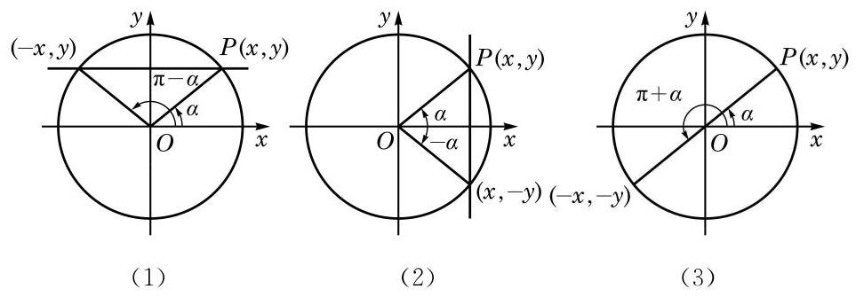

# 公式卡：5 已知正弦、余弦或正切值求角

如果 $\alpha$ 是锐角,且满足 $\sin \alpha  = \frac{1}{2}$ ,那么 $\alpha  = \frac{\pi }{6}$ . 如果不限定 $\alpha$ 是锐角,那么由诱导公式 $\sin \left( {\pi  - \alpha }\right)  = \sin \alpha  = \frac{1}{2}$ 可知, $\alpha  = \frac{5\pi }{6}$ 也满足 $\sin \alpha  = \frac{1}{2}$ . 再由诱导公式 $\sin \left( {{2k\pi } + \alpha }\right)  = \sin \alpha \left( {k \in  \mathbf{Z}}\right)$ 可知, $\alpha  = {2k\pi } + \frac{\pi }{6}$ 或 $\alpha  = {2k\pi } + \frac{5\pi }{6}\left( {k \in  \mathbf{Z}}\right)$ 都满足 $\sin \alpha  = \frac{1}{2}$ . 那么,是否还有其他的角 $\alpha$ 满足 $\sin \alpha  = \frac{1}{2}$ 呢? 下面我们就来研究这个问题.

为此目的,设 $\alpha$ 是一个任意给定的角,我们希望确定所有满足 $\sin \beta  = \sin \alpha$ 的角 $\beta$ . 设角 $\alpha$ 的终边与以原点为圆心的单位圆的交点为 $P\left( {x, y}\right)$ ,过点 $P$ 作 $y$ 轴的垂线,如图 6-1-16(1) 所示. 由正弦的定义，满足 $\sin \beta  = \sin \alpha$ 的角 $\beta$ 的终边与单位圆的交点必在此直线上.

当 $\alpha  \neq  {l\pi } + \frac{\pi }{2}\left( {l \in  \mathbf{Z}}\right)$ 时，此直线交单位圆于两点 $\left( {x, y}\right)$ 和 $\left( {-x, y}\right)$ . 由于这两点分别位于角 $\alpha$ 和角 $\pi  - \alpha$ 的终边上,因此满足 $\sin \beta  = \sin \alpha$ 的角 $\beta$ 的全体为 $\left\{  {\beta  \mid  \beta  = {2k\pi } + \alpha }\right.$ 或 $\beta  = {2k\pi } + \pi  - \alpha$ , $k \in  \mathbf{Z}\}$ ,可简记作 $\left\{  {\beta  \mid  \beta  = {k\pi } + {\left( -1\right) }^{k}\alpha , k \in  \mathbf{Z}}\right\}$ .

当 $\alpha  = {l\pi } + \frac{\pi }{2}\left( {l \in  \mathbf{Z}}\right)$ 时,过点 $P$ 且垂直于 $y$ 轴的直线与单位圆相切于 $\left( {0, y}\right)$ ,此时满足 $\sin \beta  = \sin \alpha$ 的角 $\beta$ 的全体为 $\{ \beta  \mid  \beta  = {2k\pi } + \alpha , k \in  \mathbf{Z}\}$ ,这个集合也可以用上面所示的形式来表示. 事实上, 其表达式与上述集合第一部分中所给的表达式完全相同, 而对于上述集合第二部分所给的表达式, 由于在 $\alpha  = {l\pi } + \frac{\pi }{2}\left( {l \in  \mathbf{Z}}\right)$ 时,

$$
\beta  = {2k\pi } + \pi  - \alpha  = {2k\pi } - {l\pi } + \frac{\pi }{2}
$$

$$
= 2\left( {k - l}\right) \pi  + {l\pi } + \frac{\pi }{2} = 2\left( {k - l}\right) \pi  + \alpha \left( {k - l \in  \mathbf{Z}}\right) ,
$$

此时它也与上述集合第一部分中所给的表达式一致.

这样, 我们就得到:

若 $\sin x = \sin \alpha$ ,则

$$
x = {2k\pi } + \alpha \text{ 或 }x = {2k\pi } + \pi  - \alpha , k \in  \mathbf{Z},
$$

即

$$
x = {k\pi } + {\left( -1\right) }^{k}\alpha , k \in  \mathbf{Z}.
$$

同理,如图 6-1-16(2),若角 $\alpha$ 的终边与以原点为圆心的单位圆的交点为 $P\left( {x, y}\right)$ ,则由余弦的定义,满足 $\cos \beta  = \cos \alpha$ 的角 $\beta$ 的终边与单位圆的交点在过点 $P$ 且垂直于 $x$ 轴的直线上,从而满足 $\cos \beta  = \cos \alpha$ 的角 $\beta$ 的全体为 $\left\{  {\beta  \mid  \beta  = {2k\pi } \pm  \alpha , k \in  \mathbf{Z}}\right\}$ . 这样, 我们就得到:

若 $\cos x = \cos \alpha$ ,则 $x = {2k\pi } \pm  \alpha , k \in  \mathbf{Z}$ .

如图 6-1-16(3)，若角 $\alpha$ 的终边与以原点为圆心的单位圆的交点为 $P\left( {x, y}\right)$ ,则由正切的定义,满足 $\tan \beta  = \tan \alpha$ 的角 $\beta$ 的终边与单位圆的交点在过原点 $O$ 和点 $P$ 的直线上,从而满足 $\tan \beta  = \tan \alpha$ 的角 $\beta$ 的全体为 $\{ \beta  \mid  \beta  = {k\pi } + \alpha , k \in  \mathbf{Z}\}$ . 这样,我们就得到:

若 $\tan x = \tan \alpha$ ,则 $x = {k\pi } + \alpha , k \in  \mathbf{Z}$ .
