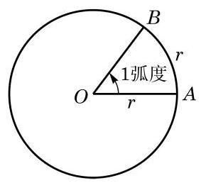

# 练习卡：练习 6.1(1)

1. 判断下列命题是否正确:

(1)终边重合的两个角相等; (2)锐角是第一象限的角；

(3)第二象限的角是钝角； (4)小于 ${90}^{ \circ  }$ 的角都是锐角.

2. 分别用集合的形式表示终边位于第三象限的所有角和终边位于 $y$ 轴正半轴上的所有角.

3. 在 ${0}^{ \circ  } \sim  {360}^{ \circ  }$ 范围内,分别找出终边与下列各角的终边重合的角,并判断它们是第几象限的角:

(1)一315°； (2)905.3°； (3)一1090°； (4) ${530}^{ \circ  }$ .

度量长度可以用米为单位, 度量质量可以用千克为单位, 适当的单位制会给解决问题带来极大的便利. 度量角的大小与度量其他量一样, 也要选择一个同类的量作为度量的单位. 在平面几何中,我们把周角的 $\frac{1}{360}$ 作为 1 度. 用 “度”作为单位来度量角的单位制叫做角度制.

表示角的方法，用角度制虽很直观，但很多情况下并不一定方便. 下面我们引入一种度量角的新方法. 观察不难发现: 在半径为 $r$ 的圆中,当圆心角为 ${360}^{ \circ  }$ 时,圆的周长为 ${2\pi r}$ ; 当圆心角为 ${180}^{ \circ  }$ 时,半圆的弧长为 ${\pi r}$ ; 而当圆心角为 ${90}^{ \circ  }$ 时,四分之一圆的弧长为 $\frac{\pi r}{2}$ . 由初中所学习的计算扇形弧长公式可知,在给定半径的圆中, 弧的长度与相应圆心角的大小成正比例关系, 因此我们不仅可以用角度来度量弧的长度,而且可以用弧长来度量角的大小. 具体来说,在半径为 $r$ 的圆周上,弧长 $l$ 与以角度度量的圆心角 $\alpha$ 之间的关系式为 $l = {2\pi r} \cdot  \frac{\alpha }{360}$ ,即 $\frac{l}{r} = \frac{\pi }{180} \cdot  \alpha$ ,这说明比值 $\frac{l}{r}$ 仅由角 $\alpha$ 的大小决定. 这样我们就可以用圆弧的长与圆半径的比值来表示这个圆弧所对的圆心角的大小. 相应地，把弧长等于半径的弧所对的圆心角叫做 1 弧度 (radian) 的角 (图 6-1-4). 用“弧度”作为单位来度量角的单位制叫做弧度制.

一般地说,如果一个半径为 $r$ 的圆的圆心角 $\alpha$ 所对的弧长为 $l$ ,那么 $\frac{l}{r}$ 就是角 $\alpha$ 的弧度的绝对值,即 $\left| \alpha \right|  = \frac{l}{r}$ ,这里 $\alpha$ 的符号由它的始边旋转至终边的方向决定. 零角的弧度数为 0 . 从弧度的定义不难得知,周角为 ${2\pi }$ 弧度,即 ${360}^{ \circ  } = {2\pi }$ 弧度; 平角为 $\pi$ 弧度,即 ${180}^{ \circ  } = \pi$ 弧度. 从而有

$$
{1}^{ \circ  } = \frac{\pi }{180}\text{ 弧度,1 弧度 } = \frac{{180}^{ \circ  }}{\pi }\text{ . }
$$

---

在学习微积分后可以更明显地看出弧度制的优点.

---
