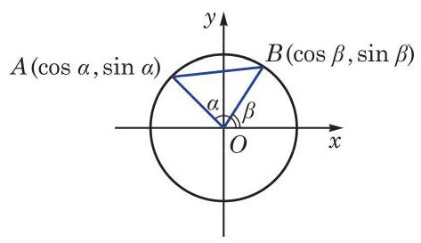
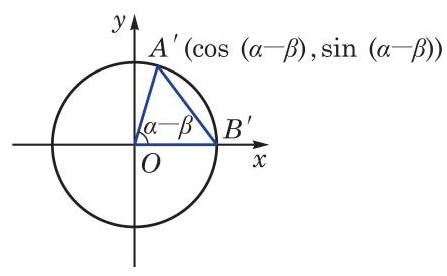

# 公式卡：1 两角和与差的正弦、余弦、正切公式

我们先推导两角差 $\left( {\alpha  - \beta }\right)$ 的余弦公式.

设 $\alpha \text{ 、 }\beta$ 为任意给定的两个角,把它们的顶点置于平面直角坐标系的原点 $O$ ,始边都与 $x$ 轴的正半轴重合,而它们的终边分别与单位圆相交于 $A\text{ 、 }B$ 两点 (图 6-2-1). 点 $A\text{ 、 }B$ 的坐标分别为 $A\left( {\cos \alpha ,\sin \alpha }\right) \text{ 、 }B\left( {\cos \beta ,\sin \beta }\right)$ .

下面考虑角 $\left( {\alpha  - \beta }\right)$ 的余弦. 为此把角 $\alpha \text{ 、 }\beta$ 的终边 ${OA}$ 及 ${OB}$ 都绕原点 $O$ 旋转 $- \beta$ 角,它们分别交单位圆于点 ${A}^{\prime }$ 及 ${B}^{\prime }$ (图6-2-2). 由于都转动了 $- \beta$ 角,因此 $\alpha  - \beta$ 也可以是一个以射线 $O{B}^{\prime }$ 为始边、以射线 $O{A}^{\prime }$ 为终边的角,而点 ${A}^{\prime }$ 的坐标是 $\left( {\cos \left( {\alpha  - \beta }\right) ,\sin \left( {\alpha  - \beta }\right) }\right)$ ,点 ${B}^{\prime }$ 的坐标是 $\left( {1,0}\right)$ .

根据两点间的距离公式,在图 6-2-1 中,有

$$
{\left| AB\right| }^{2} = {\left( \cos \alpha  - \cos \beta \right) }^{2} + {\left( \sin \alpha  - \sin \beta \right) }^{2}
$$

$$
= {\cos }^{2}\alpha  - 2\cos \alpha \cos \beta  + {\cos }^{2}\beta  + {\sin }^{2}\alpha  - 2\sin \alpha \sin \beta  + {\sin }^{2}\beta
$$

$$
= 2 - 2\cos \alpha \cos \beta  - 2\sin \alpha \sin \beta \text{ . }
$$

而在图 6-2-2 中, 有

$$
{\left| {A}^{\prime }{B}^{\prime }\right| }^{2} = {\left\lbrack  \cos \left( \alpha  - \beta \right)  - 1\right\rbrack  }^{2} + {\sin }^{2}\left( {\alpha  - \beta }\right)
$$

$$
= {\cos }^{2}\left( {\alpha  - \beta }\right)  - 2\cos \left( {\alpha  - \beta }\right)  + 1 + {\sin }^{2}\left( {\alpha  - \beta }\right)
$$

$$
= 2 - 2\cos \left( {\alpha  - \beta }\right) \text{ . }
$$

因为将射线 ${OA}\text{ 、 }{OB}$ 同时绕原点 $O$ 旋转 $- \beta$ 角,就分别得到射线 $O{A}^{\prime }\text{ 、 }O{B}^{\prime }$ ,所以

$$
\left| {AB}\right|  = \left| {{A}^{\prime }{B}^{\prime }}\right| ,
$$

从而得到

$$
2 - 2\cos \alpha \cos \beta  - 2\sin \alpha \sin \beta  = 2 - 2\cos \left( {\alpha  - \beta }\right) ,
$$

即

$$
\cos \left( {\alpha  - \beta }\right)  = \cos \alpha \cos \beta  + \sin \alpha \sin \beta .
$$

这个式子对任意给定的角 $\alpha$ 及 $\beta$ 都成立，称为两角差的余弦公式.

在两角差的余弦公式中,用 $- \beta$ 代换 $\beta$ ,就可得到两角和的余弦公式:

$$
\cos \left( {\alpha  + \beta }\right)  = \cos \alpha \cos \left( {-\beta }\right)  + \sin \alpha \sin \left( {-\beta }\right)
$$

$$
= \cos \alpha \cos \beta  - \sin \alpha \sin \beta \text{ . }
$$

这样, 我们就得到两角和与差的余弦公式

$$
\cos \left( {\alpha  + \beta }\right)  = \cos \alpha \cos \beta  - \sin \alpha \sin \beta ,
$$

$$
\cos \left( {\alpha  - \beta }\right)  = \cos \alpha \cos \beta  + \sin \alpha \sin \beta .
$$

简记作

$$
\cos \left( {\alpha  \pm  \beta }\right)  = \cos \alpha \cos \beta  \mp  \sin \alpha \sin \beta .
$$
