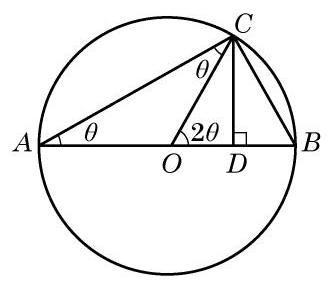

# 方法卡：课后阅读

##### 三角变换公式简史

三角变换公式很早就为数学家所熟知. 在古希腊时期, 由于研究天文的需要, 所考察的主要是球面三角学. 数学家托勒密(C. Ptolemy)在其《大汇编》一书中就给出了已知 $\sin A$ 及 $\sin B$ ,求 $\sin \left( {A + B}\right)$ 与 $\sin \left( {A - B}\right)$ 的方法,即两角和与差的正弦公式 $\sin \left( {A \pm  B}\right)  = \; \sin A\cos B \pm  \cos A\sin B$ . 他在书中还详细给出了在知道 ${72}^{ \circ  }$ 及 ${60}^{ \circ  }$ 的正弦的基础上,如何求出 ${12}^{ \circ  }$ 的正弦的方法,并给出了已知 $\sin A$ 求 $\sin \frac{A}{2}$ 和 $\sin {2A}$ 的方法. 在此基础上,他对从 ${0}^{ \circ  }$ 到 ${180}^{ \circ  }$ 间所有相差 ${\left( \frac{1}{2}\right) }^{ \circ  }$ 的角度编制出了正弦表.

虽然很多三角恒等式在托勒密的《大汇编》中都已存在, 但法国数学家韦达(F. Viete) 进行了较为系统的整理、补充和发展. 韦达是最早将代数变换方法引入三角学的人，他不仅给出了和差化积公式,也对 $n$ 倍角的 $\sin {n\alpha }$ 及 $\cos {n\alpha }$ 进行了深入的研究. 在研究奇数等分角的过程中,他发现了一元三次方程 ${x}^{3} - 3{a}^{2}x = {a}^{2}b\left( {a > 0, b > 0, a > \frac{b}{2}}\right)$ 如下的三角解法: 在三倍角余弦公式 $\cos {3\alpha } = 4{\cos }^{3}\alpha  - 3\cos \alpha$ 中,令 $\frac{b}{a} = 2\cos {3\alpha }$ ,就可知 $x = {2a}\cos \alpha$ 为上述三次方程的一个根. 不仅如此,他还根据 $n$ 倍角的 $\sin {n\alpha }$ 的公式,给出了一个 45 次方程的 23 个根 (可惜的是, 其余的 22 个负根均被舍去).

从三角学发展史看, 利用几何知识证明三角变换公式十分常见, 韦达就曾用几何知识证明了和差化积公式. 这里我们给出倍角公式的一个几何证明方法.

如图 6-2-4, ${AB}$ 是圆心为 $O$ 且半径为 1 的圆的一条直径,点 $C$ 为圆上一点. 连接 ${CO}$ ,并过点 $C$ 作 ${CD} \bot  {AB}$ ,记其垂足为 $D$ . 设 $\angle {CAB} = \theta$ ,则 $\angle {COB} = {2\theta }$ . 因为 ${AB}$ 为圆 $O$ 的一条直径,所以 $\angle {ACB} = {90}^{ \circ  }$ .

在直角三角形 ${ACB}$ 中,有 ${AC} = 2\cos \theta$ . 于是,在直角三角形 ${ACD}$ 中,就有 ${CD} = {AC}\sin \theta  = 2\cos \theta \sin \theta$ 及 ${OD} = {AD} - {AO} = \; {AC}\cos \theta  - 1 = 2{\cos }^{2}\theta  - 1.$

但在直角三角形 ${CDO}$ 中,有 ${CD} = \sin {2\theta },{OD} = \cos {2\theta }$ .

比较上面的式子,就得到倍角公式: $\sin {2\theta } = 2\sin \theta \cos \theta ,\cos {2\theta } = 2{\cos }^{2}\theta  - 1$ .

同学们也可思考其他一些三角变换公式的几何证明. 虽然几何方法直观, 但在上述公式的证明过程中,角的限定范围多在 ${0}^{ \circ  } \sim  {90}^{ \circ  }$ 或 ${0}^{ \circ  } \sim  {180}^{ \circ  }$ 之间. 考虑到一般性,我们在本书中借助于平面直角坐标系及单位圆来论证三角公式, 并利用代换和转化思想得到更多的三角公式.
