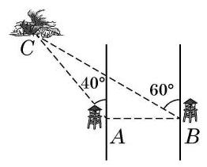
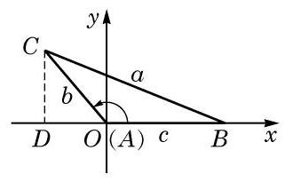

# 定理卡：1 正弦定理

在初中我们已学习了直角三角形的求解问题, 但在解决实际问题时, 所遇到的三角形往往不是直角三角形. 我们将不是直角三角形的三角形统称为斜三角形. 在三角形的三个角和三条边这六个元素中, 经常会遇到已知其中三个元素 (至少一个元素为边) 求其他元素的问题, 这称为解三角形. 为此, 需要知道边和角之间的数量关系.

例如,某林场为了及时发现火情,设立了两个观测点 $A$ 和 $B$ . 某日两个观测点的林场人员都观测到 $C$ 处出现火情. 在 $A$ 处观测到火情发生在北偏西 ${40}^{ \circ  }$ 方向，而在 $B$ 处观测到火情在北偏西 60° 方向. 已知 $B$ 在 $A$ 的正东方向 ${10}\mathrm{\;{km}}$ 处 (图 6-3-1),要确定火场 $C$ 分别距 $A$ 及 $B$ 多远. 将此问题转化为数学问题: 在 $\bigtriangleup {ABC}$ 中,已知 $\angle {CAB} = {130}^{ \circ  },\angle {CBA} = {30}^{ \circ  },{AB} = {10}\mathrm{\;{km}}$ . 求 ${AC}$ 与 ${BC}$ 的长.

为解答这个斜三角形问题, 就要研究斜三角形中边与角之间的关系.

在 $\bigtriangleup {ABC}$ 中,无论 $A$ 为锐角、直角还是钝角,对边 ${AB}$ 上的高 $h$ ,都有 $h = b\sin A$ ,其中 $b$ 为边 ${AC}$ 的长. 为了避免分类讨论, 我们借助平面直角坐标系来统一处理.

如图 6-3-2,以 $\bigtriangleup {ABC}$ 的顶点 $A$ 为坐标原点,边 ${AB}$ 所在直线为 $x$ 轴,建立平面直角坐标系. 将角 $A\text{ 、 }B$ 及 $C$ 所对边的边长分别记作 $a\text{ 、 }b$ 及 $c$ ,则点 $B\text{ 、 }C$ 的坐标分别为 $\left( {c,0}\right)$ 及 $\left( {b\cos A, b\sin A}\right)$ ,而 $\bigtriangleup {ABC}$ 的面积 ${S}_{\bigtriangleup {ABC}} = \frac{1}{2}{AB} \cdot  h = \frac{1}{2}{bc}\sin A$ . 同理可得 ${S}_{\bigtriangleup {ABC}} = \frac{1}{2}{ac}\sin B,{S}_{\bigtriangleup {ABC}} = \frac{1}{2}{ab}\sin C$ .

---

本章以后若不特别说明,在 $\bigtriangleup {ABC}$ 中角 $A\text{ 、 }B\text{ 、 }C$ 所对边的边长都分别记作 $a$ 、 $b\text{ 、 }c$ .

---

这就是说, 三角形的面积等于任意两边与它们夹角正弦值的乘积的一半, 即三角形的面积公式为

$$
{S}_{\bigtriangleup {ABC}} = \frac{1}{2}{ab}\sin C = \frac{1}{2}{ac}\sin B = \frac{1}{2}{bc}\sin A.
$$

将上式同时除以 $\frac{1}{2}{abc}$ ,就得到

$$
\frac{\sin A}{a} = \frac{\sin B}{b} = \frac{\sin C}{c},
$$

即

$$
\frac{a}{\sin A} = \frac{b}{\sin B} = \frac{c}{\sin C}.
$$

这样,我们就得到了正弦定理: 在 $\bigtriangleup {ABC}$ 中,若角 $A\text{ 、 }B$ 及 $C$ 所对边的边长分别为 $a\text{ 、 }b$ 及 $c$ ,则有

$$
\frac{a}{\sin A} = \frac{b}{\sin B} = \frac{c}{\sin C}.
$$

---

正弦定理是“大角对大边”这一几何性质的定量刻画.

---
