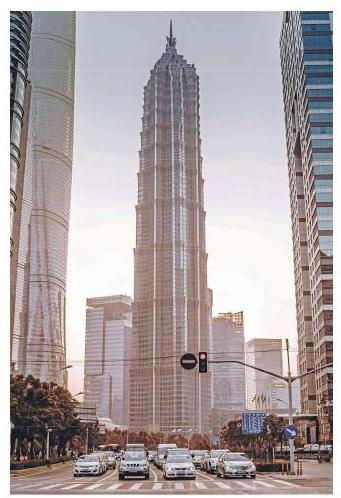

# 练习卡：练习 6.3(3)

1. 在 $\bigtriangleup {ABC}$ 中,已知 $a = 4, B = {60}^{ \circ  }$ ,其面积为 $5\sqrt{3}$ . 求 $b$ .

2. 证明: 平行四边形中, 四边平方和等于对角线平方和.

3. 在 $\bigtriangleup {ABC}$ 中,求证:

(1) $\frac{{a}^{2} + {b}^{2}}{{c}^{2}} = \frac{{\sin }^{2}A + {\sin }^{2}B}{{\sin }^{2}C}$ ;

(2) ${a}^{2} + {b}^{2} + {c}^{2} = 2\left( {{bc}\cos A + {ac}\cos B + {ab}\cos C}\right)$ .

4. 分别求满足下列条件的角.

(1) $\sin x = \frac{3}{5}, x \in  \left\lbrack  {-\frac{\pi }{2},\frac{\pi }{2}}\right\rbrack$ ; (2) $\cos x =  - \frac{2}{3}, x \in  \left\lbrack  {0,\pi }\right\rbrack$ ;

(3) $\tan x =  - 2, x \in  \left( {-\frac{\pi }{2},\frac{\pi }{2}}\right)$ ; (4) $\sin x =  - \frac{2}{3}, x \in  \mathbf{R}$ .

解三角形在实际生活中, 尤其是在测量方面, 有着广泛的应用. 下面通过一些实例来体会解三角形在测量上的应用.

