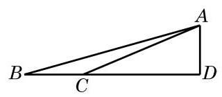

# 例题卡：例 10 金茂大厦是改革开放以来上海出现的超高层标志性建筑. 有一位测量爱好者在与金茂大厦底部同一水平线上的 $B$ 处测得金茂大厦顶部 $A$ 的仰角为 ${15.66}^{ \circ  }$ ,再向金茂大厦前进 ${500}\mathrm{\;m}$ 到达 $C$ 处,测得金茂大厦顶部 $A$ 的仰角为 ${22.81}^{ \circ  }$ . 请根据以上数据估算出金茂大厦的高度. (结果精确到 $1\mathrm{\;m}$ )

例 10 金茂大厦是改革开放以来上海出现的超高层标志性建筑. 有一位测量爱好者在与金茂大厦底部同一水平线上的 $B$ 处测得金茂大厦顶部 $A$ 的仰角为 ${15.66}^{ \circ  }$ ,再向金茂大厦前进 ${500}\mathrm{\;m}$ 到达 $C$ 处,测得金茂大厦顶部 $A$ 的仰角为 ${22.81}^{ \circ  }$ . 请根据以上数据估算出金茂大厦的高度. (结果精确到 $1\mathrm{\;m}$ )

解 根据题意, 作出如图 6-3-4 所示的示意图, 问题转化为求直角三角形 ${ABD}$ 中边 ${AD}$ 的长.

在 $\bigtriangleup {ABC}$ 中, $\angle {ABC} = {15.66}^{ \circ  },\angle {BAC} = {22.81}^{ \circ  } - {15.66}^{ \circ  } = \; {7.15}^{ \circ  },{BC} = {500}\mathrm{\;m}$ .

由正弦定理,有 $\frac{500}{\sin {7.15}^{ \circ  }} = \frac{AC}{\sin {15.66}^{ \circ  }}$ ,即

$$
{AC} = \frac{{500}\sin {15.66}^{ \circ  }}{\sin {7.15}^{ \circ  }} \approx  {1084.3}\left( \mathrm{\;m}\right) .
$$

从而 ${AD} = {AC} \times  \sin {22.81}^{ \circ  } \approx  {420}\left( \mathrm{\;m}\right)$ .

所以，所估算的金茂大厦高度约为 ${420}\mathrm{\;m}$ .
