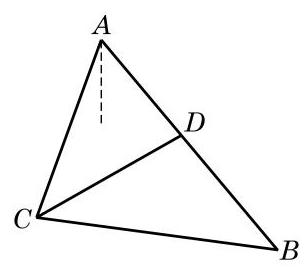

# 例题卡：例 11 甲船在距离 $A$ 港口 24 海里并在南偏西 ${20}^{ \circ  }$ 方向的 $C$ 处驻留等候进港，乙船在 $A$ 港口南偏东 ${40}^{ \circ  }$ 方向的 $B$ 处沿直线行驶入港，甲、乙两船距离为 31 海里. 当乙船行驶 20 海里到达 $D$ 处时,接到港口指令,前往救援忽然发生火灾的甲船. 求此时甲、乙两船之间的距离.

例 11 甲船在距离 $A$ 港口 24 海里并在南偏西 ${20}^{ \circ  }$ 方向的 $C$ 处驻留等候进港，乙船在 $A$ 港口南偏东 ${40}^{ \circ  }$ 方向的 $B$ 处沿直线行驶入港，甲、乙两船距离为 31 海里. 当乙船行驶 20 海里到达 $D$ 处时,接到港口指令,前往救援忽然发生火灾的甲船. 求此时甲、乙两船之间的距离.

解 根据题意, 作出如图 6-3-5 所示的示意图, 其中

$$
{AC} = {24},{BC} = {31},\angle {CAD} = {20}^{ \circ  } + {40}^{ \circ  } = {60}^{ \circ  }.
$$

在 $\bigtriangleup {ABC}$ 中,由正弦定理,得 $\frac{24}{\sin \angle {ABC}} = \frac{31}{\sin {60}^{ \circ  }}$ ,从而 $\sin \angle {ABC} = \frac{{12}\sqrt{3}}{31}.$

由 ${AC} < {BC}$ ,知 $\angle {ABC}$ 为锐角,故

$$
\cos \angle {ABC} = \sqrt{1 - {\sin }^{2}\angle {ABC}} = \frac{23}{31}.
$$

在 $\bigtriangleup {BCD}$ 中,由余弦定理,有

$$
{CD} = \sqrt{B{C}^{2} + B{D}^{2} - {2BD} \cdot  {BC} \cdot  \cos \angle {ABC}}
$$

$$
= \sqrt{{31}^{2} + {20}^{2} - 2 \times  {31} \times  {20} \times  \frac{23}{31}}
$$

$$
= {21}\text{ (海里). }
$$

所以, 此时甲、乙两船之间的距离为 21 海里.
