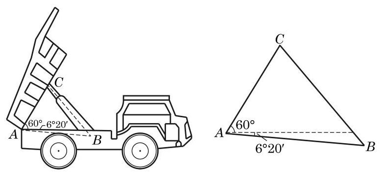
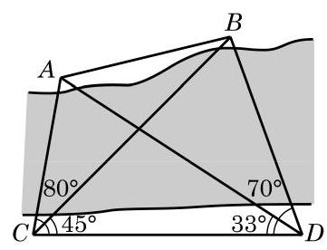

# 概念卡：习题 6.3

##### A 组

1. 在 $\bigtriangleup {ABC}$ 中,已知 $A = {120}^{ \circ  }, B = {45}^{ \circ  },{AC} = 2$ . 求 ${BC}$ .

2. 在 $\bigtriangleup {ABC}$ 中,已知 $b = {40}, c = {32}, A = {60}^{ \circ  }$ . 求 $a$ .

3. 在 $\bigtriangleup {ABC}$ 中,若 $a = 7, b = 8,\cos C = \frac{13}{14}$ . 求最大角的余弦值.

4. 已知 $\bigtriangleup {ABC}$ 的面积为 $3, a = 3, b = 2\sqrt{2}$ . 求 $c$ .

5. 在 $\bigtriangleup {ABC}$ 中,已知 $b = 2, c = \sqrt{2}, B = {45}^{ \circ  }$ . 求 $C\text{ 、 }a$ 及 $A$ .

6. 在 $\bigtriangleup {ABC}$ 中,若 $c = 2, C = \frac{\pi }{3}$ ,且其面积为 $\sqrt{3}$ ,求 $a$ 及 $b$ .

7. 在 $\bigtriangleup {ABC}$ 中,已知 ${AD}$ 是 $\angle {BAC}$ 的内角平分线. 求证: $\frac{AB}{AC} = \frac{BD}{DC}$ .

8. 在 $\bigtriangleup {ABC}$ 中,已知 ${AB} = \sqrt{3},{BC} = 3,{AC} = 4$ . 求边 ${AC}$ 上的中线 ${BD}$ 的长.

9. 根据下列条件,分别判断三角形 ${ABC}$ 的形状:

(1) $a = {2b}\cos C$ ；

(2) $\tan B = \frac{\cos \left( {B - C}\right) }{\sin A - \sin \left( {B - C}\right) }$ .

10. 如图,自动卸货汽车采用液压机构,设计时需要计算油泵顶杆 ${BC}$ 的长度. 已知车厢的最大仰角为 ${60}^{ \circ  }$ ,油泵顶点 $B$ 与车厢支点 $A$ 之间的距离为 ${1.95}\mathrm{\;m},{AB}$ 与水平线之间的夹角为 ${6}^{ \circ  }{20}^{\prime },{AC}$ 的长为 ${1.4}\mathrm{\;m}$ . 计算 ${BC}$ 的长. (结果精确到 ${0.01}\mathrm{\;m}$ )

(第 10 题)

##### B 组

1. 在 $\bigtriangleup {ABC}$ 中，若 $\sqrt{3}a = {2b}\sin A$ ，求 $B$ .

2. 已知 $\bigtriangleup {ABC}$ 的面积 $S = \frac{{b}^{2} + {c}^{2} - {a}^{2}}{4}$ ,求 $A$ .

3. 在 $\bigtriangleup {ABC}$ 中,已知 $a = {13}, b = {14}, c = {15}$ .

(1)求 $\cos A$ ；

(2)求 $\bigtriangleup  {ABC}$ 的面积 $S$ .

4. 已知三角形两边之和为 8，其夹角为 ${60}^{ \circ  }$ . 分别求这个三角形周长的最小值和面积的最大值, 并指出面积最大时三角形的形状.

5. 求分别满足下列条件的角:

(1) $\sin x = \frac{2}{5}, x \in  \left\lbrack  {0,\pi }\right\rbrack$ ; (2) $\cos x =  - \frac{2}{3}, x \in  \left\lbrack  {0,{2\pi }}\right\rbrack$ ；

(3) $\tan x =  - \frac{1}{2}, x \in  \mathbf{R}$ .

6. 在 $\bigtriangleup {ABC}$ 中, $A = {60}^{ \circ  }, b = 1$ ,且其面积为 $\sqrt{3}$ . 求 $a$ .

7. 某船在海面 $A$ 处测得灯塔 $C$ 在北偏东 ${30}^{ \circ  }$ 方向，与 $A$ 相距 ${10}\sqrt{3}$ 海里，且测得灯塔 $B$ 在北偏西 ${75}^{ \circ  }$ 方向,与 $A$ 相距 ${15}\sqrt{6}$ 海里. 船由 $A$ 向正北方向航行到 $D$ 处,测得灯塔 $B$ 在南偏西 ${60}^{ \circ  }$ 方向. 这时灯塔 $C$ 与 $D$ 相距多少海里? $C$ 在 $D$ 的什么方向?

(第 8 题)

8. 如图,为了测定对岸 $A\text{ 、 }B$ 两点之间的距离,在河的一岸定一条基线 ${CD}$ ,测得 ${CD} = {100}\mathrm{\;m},\angle {ACD} = {80}^{ \circ  },\angle {BCD} = \; {45}^{ \circ  },\angle {BDC} = {70}^{ \circ  },\angle {ADC} = {33}^{ \circ  }$ . 求 $A\text{ 、 }B$ 间的距离. (结果精确到 ${0.01}\mathrm{\;m}$ )

9. 在 $\bigtriangleup {ABC}$ 中,求证:

(1) $\frac{\cos {2A}}{{a}^{2}} - \frac{\cos {2B}}{{b}^{2}} = \frac{1}{{a}^{2}} - \frac{1}{{b}^{2}}$ ;

(2) $\left( {{a}^{2} - {b}^{2} - {c}^{2}}\right) \tan A + \left( {{a}^{2} - {b}^{2} + {c}^{2}}\right) \tan B = 0$ .
