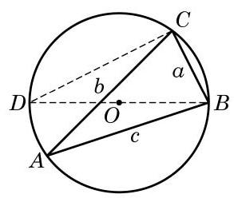

# 例题卡：例 1 如图 6-3-1,在 $\bigtriangleup {ABC}$ 中,已知 $\angle {CAB} = {130}^{ \circ  }$ , $\angle {CBA} = {30}^{ \circ  },{AB} = {10}\mathrm{\;{km}}$ . 求 ${AC}$ 与 ${BC}$ 的长. (结果精确到 ${0.1}\mathrm{\;{km}}$ )

例 1 如图 6-3-1,在 $\bigtriangleup {ABC}$ 中,已知 $\angle {CAB} = {130}^{ \circ  }$ , $\angle {CBA} = {30}^{ \circ  },{AB} = {10}\mathrm{\;{km}}$ . 求 ${AC}$ 与 ${BC}$ 的长. (结果精确到 ${0.1}\mathrm{\;{km}}$ )

解 在 $\bigtriangleup {ABC}$ 中,由于 $C = {180}^{ \circ  } - {130}^{ \circ  } - {30}^{ \circ  } = {20}^{ \circ  }$ ,由正弦定理, 得

$$
\frac{a}{\sin {130}^{ \circ  }} = \frac{b}{\sin {30}^{ \circ  }} = \frac{10}{\sin {20}^{ \circ  }},
$$

从而

$$
a = {10} \times  \frac{\sin {130}^{ \circ  }}{\sin {20}^{ \circ  }} \approx  {22.4}\left( \mathrm{\;{km}}\right) , b = {10} \times  \frac{\sin {30}^{ \circ  }}{\sin {20}^{ \circ  }} \approx  {14.6}\left( \mathrm{\;{km}}\right) .
$$

所以， ${AC}$ 长约为 ${14.6}\mathrm{\;{km}}$ ， ${BC}$ 长约为 ${22.4}\mathrm{\;{km}}$ .

利用例 1 的结果, 在本节一开始所考虑的问题中, 就可以确定火场 $C$ 的位置.

正弦定理表明三角形的各边和它所对角的正弦的比相等. 那么, 这个比的几何意义是什么呢?

