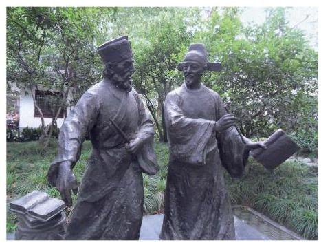

# 定理卡：课后阅读

##### 三角学发展简史

平面三角形的正弦定理是直角三角形边角关系的推广, 余弦定理是勾股定理的推广. 早在我国商代与古希腊时期就已发现了勾股定理(又称毕达哥拉斯定理)，但平面三角的正弦定理与余弦定理却出现得很晚. 在古希腊, 三角学的起源、发展与天文学密不可分, 人们需要使用三角知识来建立定量的天文学，通过测量天体的运动路线和位置用于报时、航海、历法推算和地理研究等, 因此对球面三角的研究比平面三角更早、更深入. 对于平面测量问题, 古希腊人认为利用平面几何知识已经足够.

公元 9 世纪左右，阿拉伯天文学家阿尔·巴塔尼(Al-Battani)以习题形式给出了平面上的余弦定理. 15 世纪，阿尔·卡西(Al-Kashi)给出了余弦定理的下述形式: ${a}^{2} = {\left( b - c\cos A\right) }^{2} + {c}^{2}{\sin }^{2}A$ . 现在所见到的余弦定理是由 16 世纪法国数学家韦达首次给出的. 著名天文学家阿尔·比鲁尼 (Al-Biruni) 给出了平面三角形的正弦定理, 并给予了证明.

1450 年前的三角学主要是球面三角, 而大地上的测量学还是采用几何方法. 最早将三角学从天文学中独立出来的代表人物是德国数学家约翰·穆勒(J. Müller), 其笔名雷格蒙塔努斯(J. Regiomontanus)更广为人知. 他在 1464 年完成了 5 卷本《论各种三角形》. 这部著作首次对三角学作出了系统性阐述，将平面三角、球面几何和球面三角中有关的知识综合起来, 建立了现代三角学的雏形. 法国数学家韦达将平面和球面三角进一步系统化并加以发展. 正是由于众多数学家的努力, 16 世纪三角学从天文学中分离出来, 成为数学的一个独立分支.

徐光启(1562—1633)，明末科学家，字子先，上海人. 曾译拉丁文 sinus 为 “正弦”，这是现在我们所用 “正弦”这一术语的由来. 徐光启等人还编写了《测量法义》和 《测量异同》. 在这些著作中, 不仅有我们熟悉的正弦定理, 还比较系统地给出了直角三角形和斜三角形的解法. 徐光启将西方的三角知识传播到了中国，并与意大利人利玛窦(M. Ricci)合作翻译了《几何原本》的前 6 卷，被称为中国近代科学的先驱.
