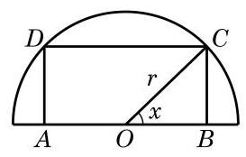

# 例题卡：例 6 如图 7-1-7,在一个半径为 $r$ 的半圆形铁板中,截取一块矩形 ${ABCD}$ ,使得矩形的顶点 $A\text{ 、 }B$ 在半圆的直径上, $C\text{ 、 }D$ 在半圆弧上. 问: 如何截取矩形 ${ABCD}$ ,使其面积达到最大值? 并求出这个最大值.

例 6 如图 7-1-7,在一个半径为 $r$ 的半圆形铁板中,截取一块矩形 ${ABCD}$ ,使得矩形的顶点 $A\text{ 、 }B$ 在半圆的直径上, $C\text{ 、 }D$ 在半圆弧上. 问: 如何截取矩形 ${ABCD}$ ,使其面积达到最大值? 并求出这个最大值.

解 连接 ${OC}$ . 设 $\angle {COB} = x, x \in  \left( {0,\frac{\pi }{2}}\right)$ ,矩形 ${ABCD}$ 的面积为 $y$ ,则 ${AB} = {2r}\cos x,{BC} = r\sin x$ ,而

$$
y = {AB} \cdot  {BC}
$$

$$
= {2r}\cos x \cdot  r\sin x
$$

$$
= {r}^{2}\sin {2x}, x \in  \left( {0,\frac{\pi }{2}}\right) .
$$

由此可知,当且仅当 $x = \frac{\pi }{4}$ 时,矩形 ${ABCD}$ 的面积 $y$ 有最大值 ${r}^{2}$ . 因此,在半圆形铁板中应截取 ${AB} = \sqrt{2}r,{BC} = \frac{\sqrt{2}}{2}r$ ,这时矩形 ${ABCD}$ 的面积达到最大值 ${r}^{2}$ .
