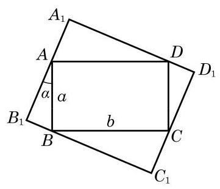

# 练习卡：练习 7.1(3)

1. 求下列函数的定义域和值域:

(1) $y = \sin \left( {x + \frac{\pi }{2}}\right)$ ；___ (2) $y = {2}^{\sin x}$ .

2. 求下列函数的最大值与最小值:

(第 3 题)

(1) $y =  - 5 + \sin \left( {{2x} + \frac{\pi }{4}}\right)$ ；

(2) $y = {\cos }^{2}x + 2\sin x$ ；___

(3) $y = 2\sin x \cdot  \cos x - \sqrt{3}{\cos }^{2}x + \sqrt{3}{\sin }^{2}x$ .

3. 如图,矩形 ${ABCD}$ 的四个顶点分别在矩形 ${A}_{1}{B}_{1}{C}_{1}{D}_{1}$ 的四条边上, ${AB} = a,{BC} = b$ . 如果 ${AB}$ 与 ${A}_{1}{B}_{1}$ 的夹角为 $\alpha$ ,那么当 $\alpha$ 取何值时,矩形 ${A}_{1}{B}_{1}{C}_{1}{D}_{1}$ 的周长最大?
