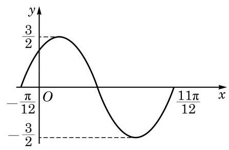

# 练习卡：练习 7.3

1. 作出下列函数的大致图像:

(1) $y = \sin \left( {x + \frac{\pi }{6}}\right)$ ； (2) $y = 3\sin \left( {{2x} - \frac{\pi }{3}}\right)$ .

2. 下列函数中,与函数 $y = 5\sin \left( {{3x} + \frac{\pi }{4}}\right)$ 的图像形状相同的是 ( )

A. $y = 8\sin \left( {{3x} + \frac{\pi }{4}}\right)$ ; B. $y = 3\sin \left( {{5x} + \frac{\pi }{4}}\right)$ ;

C. $y = 5\sin 2\left( {x + \frac{\pi }{4}}\right)$ ; D. $y = 5\sin 3\left( {x + \frac{\pi }{4}}\right)$ .

3. 下图是函数 $y = A\sin \left( {{\omega x} + \varphi }\right)$ 的图像,请根据图中的信息,写出该图像的一个函数表达式.

(第 3 题)

##### 探究与实践

###### 潮汐的函数模拟

在月亮和太阳的引力作用下，海水水面发生的周期性涨落现象叫做潮汐. 一般早潮叫潮, 晚潮叫汐. 下面是某港有一天记录的潮汐高度 (cm) 与相应时间 (h) 的关系表 (表7-3) 和潮汐曲线图 (图 7-3-6):

表 7-3
