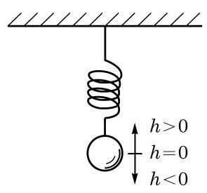
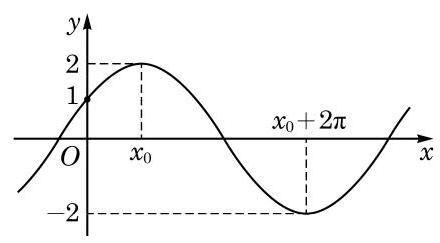

# 概念卡：习题 7.3

##### A 组

1. 当函数 $y = A\sin \left( {{\omega x} + \varphi }\right) \left( {A > 0,\omega  > 0}\right)$ 中的常数 $A\text{ 、 }\omega \text{ 、 }\varphi$ 分别取下列各组值时, 在同一平面直角坐标系中分别作出它们的图像:

(1) $A = \frac{1}{2},\omega  = 1,\varphi  = 0$ ； (2) $A = 1,\omega  = \frac{1}{2},\varphi  = 0$ ；

(3) $A = 1,\omega  = 1,\varphi  =  - \frac{\pi }{2}$ .

2. 求函数 $y = \sqrt{2}\sin \left( {{30\pi x} - \frac{\pi }{12}}\right)$ 的振幅、频率和初始相位.

3. 已知某交流电流 $I\left( \mathrm{\;A}\right)$ 随时间 $t\left( \mathrm{\;s}\right)$ 的变化规律可以用函数 $I = 8\sin \left( {{100\pi t} - \frac{\pi }{2}}\right)$ ， $t \in  \lbrack 0, + \infty )$ 表示. 求这种交流电流在 ${0.5}\mathrm{\;s}$ 内往复运行的次数.

4. 作出函数 $y = 2\sin \left( {\frac{1}{2}x + \frac{\pi }{6}}\right)$ 的大致图像.

5. 如图, 弹簧挂着的小球上下振动. 设小球相对于平衡位置(即静止时的位置) 的距离 $h\left( \mathrm{\;{cm}}\right)$ 与时间 $t\left( \mathrm{\;s}\right)$ 之间的函数表达式是 $h = 2\sin \left( {{\pi t} + \frac{\pi }{4}}\right) , t \geq  0$ ,作出这个函数的大致图像,并回答下列问题:

(第 5 题)

(1)小球开始振动 (即 $t = 0$ ) 时的位置在哪里?

(2)小球最高点和最低点与平衡位置的距离分别是多少？

(3)经过多少时间小球往复振动一次？

(4)每秒钟小球往复振动多少次？

##### B 组

(第 2 题)

1. 作出函数 $y = \sin x + \sqrt{3}\cos x$ 的大致图像.

2. 如图,已知函数 $y = A\cos \left( {{\omega x} + \varphi }\right) (A > 0,\omega  > 0$ , $0 < \varphi  < {2\pi })$ 的图像与 $y$ 轴的交点为 $\left( {0,1}\right)$ ,并已知其在 $y$ 轴右侧的第一个最高点和第一个最低点的坐标分别为 $\left( {{x}_{0},2}\right)$ 和 $\left( {{x}_{0} + {2\pi }, - 2}\right)$ . 求此函数的表达式.

3. 三相交流电的插座上有四个插孔, 其电压分别为

$$
{U}_{0} = 0,{U}_{1} = A\sin {\omega t},{U}_{2} = A\sin \left( {{\omega t} + \frac{2\pi }{3}}\right) ,{U}_{3} = A\sin \left( {{\omega t} + \frac{4\pi }{3}}\right) ,
$$

其中 $\omega  = {100\pi }\mathrm{{rad}}/\mathrm{s}, A = {220}\sqrt{2}\mathrm{\;V}$ . 记 ${U}_{2} - {U}_{1},{U}_{3} - {U}_{2},{U}_{1} - {U}_{3}$ 的最大值分别为 ${Y}_{1}$ 、 ${Y}_{2}\text{ 、 }{Y}_{3}$ ,试计算三相交流电的线电压的有效值 $\frac{{Y}_{1}}{\sqrt{2}}\text{ 、 }\frac{{Y}_{2}}{\sqrt{2}}$ 及 $\frac{{Y}_{3}}{\sqrt{2}}$ .
