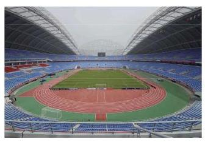
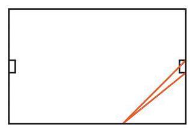

# 练习卡：练习 7.4

1. 写出满足 $\tan \alpha  = \sqrt{3}$ 的所有 $\alpha$ 的集合.

2. 比较下列各组数的大小, 并说明理由:

(1) $\tan \left( {-\frac{2}{7}\pi }\right)$ 与 $\tan \left( {-\frac{2}{5}\pi }\right)$ ; (2) $\cot {231}^{ \circ  }$ 与 $\cot {237}^{ \circ  }$ ；

(3) $\tan \left( {{k\pi } - \frac{\pi }{3}}\right)$ 与 $\tan \left( {{k\pi } + \frac{\pi }{3}}\right) , k \in  \mathbf{Z}$ .

3. 求函数 $y = \tan \left( {{3x} + \frac{\pi }{4}}\right)$ 的定义域,并写出其单调区间.

##### 探究与实践

###### 球门的张角问题

某国际标准足球场长 ${105}\mathrm{\;m}$ 、宽 ${68}\mathrm{\;m}$ ,球门宽 ${7.32}\mathrm{\;m}$ . 当足球运动员沿边路带球突破时, 距底线多远处射门, 对球门所张的角最大?

