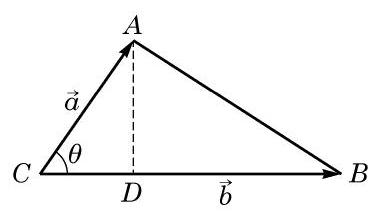

# 例题卡：例 4 在 $\bigtriangleup {ABC}$ 中,设 $\overrightarrow{CA} = \overrightarrow{a},\overrightarrow{CB} = \overrightarrow{b}$ ,记 $\bigtriangleup {ABC}$ 的面积为 $S$ .

例 4 在 $\bigtriangleup {ABC}$ 中,设 $\overrightarrow{CA} = \overrightarrow{a},\overrightarrow{CB} = \overrightarrow{b}$ ,记 $\bigtriangleup {ABC}$ 的面积为 $S$ .

(1)求证: $S = \frac{1}{2}\sqrt{{\left| \overrightarrow{a}\right| }^{2}{\left| \overrightarrow{b}\right| }^{2} - {\left( \overrightarrow{a} \cdot  \overrightarrow{b}\right) }^{2}}$ ；

(2)设 $\overrightarrow{a} = \left( {{x}_{1},{y}_{1}}\right) ,\overrightarrow{b} = \left( {{x}_{2},{y}_{2}}\right)$ . 求证: $S = \; \frac{1}{2}\left| {{x}_{1}{y}_{2} - {x}_{2}{y}_{1}}\right| .$

证明 ( 1 )如图 8-4-3,设 $\angle C = \langle \overrightarrow{a},\overrightarrow{b}\rangle  = \theta$ . 我们有 $S = \; \frac{1}{2}\left| a\right| \left| b\right| \sin \theta$ ,于是

$$
{S}^{2} = \frac{1}{4}{\left| \overrightarrow{a}\right| }^{2}{\left| \overrightarrow{b}\right| }^{2}{\sin }^{2}\theta
$$

$$
= \frac{1}{4}{\left| \overrightarrow{a}\right| }^{2}{\left| \overrightarrow{b}\right| }^{2}\left( {1 - {\cos }^{2}\theta }\right)
$$

$$
= \frac{1}{4}\left( {{\left| \overrightarrow{a}\right| }^{2}{\left| \overrightarrow{b}\right| }^{2} - {\left| \overrightarrow{a}\right| }^{2}{\left| \overrightarrow{b}\right| }^{2}{\cos }^{2}\theta }\right)
$$

$$
= \frac{1}{4}\left\lbrack  {{\left| \overrightarrow{a}\right| }^{2}{\left| \overrightarrow{b}\right| }^{2} - {\left( \overrightarrow{a} \cdot  \overrightarrow{b}\right) }^{2}}\right\rbrack  ,
$$

所以 $S = \frac{1}{2}\sqrt{{\left| \overrightarrow{a}\right| }^{2}{\left| \overrightarrow{b}\right| }^{2} - {\left( \overrightarrow{a} \cdot  \overrightarrow{b}\right) }^{2}}$ .

(2)因为

$$
{\left| \overrightarrow{a}\right| }^{2}{\left| \overrightarrow{b}\right| }^{2} - {\left( \overrightarrow{a} \cdot  \overrightarrow{b}\right) }^{2} = \left( {{x}_{1}^{2} + {y}_{1}^{2}}\right) \left( {{x}_{2}^{2} + {y}_{2}^{2}}\right)  - {\left( {x}_{1}{x}_{2} + {y}_{1}{y}_{2}\right) }^{2}
$$

$$
= {x}_{1}^{2}{y}_{2}^{2} - 2{x}_{1}{x}_{2}{y}_{1}{y}_{2} + {x}_{2}^{2}{y}_{1}^{2}
$$

$$
= {\left( {x}_{1}{y}_{2} - {x}_{2}{y}_{1}\right) }^{2}\text{ , }
$$

所以 $S = \frac{1}{2}\left| {{x}_{1}{y}_{2} - {x}_{2}{y}_{1}}\right|$ .
