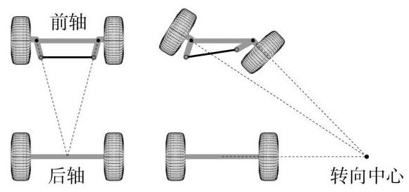
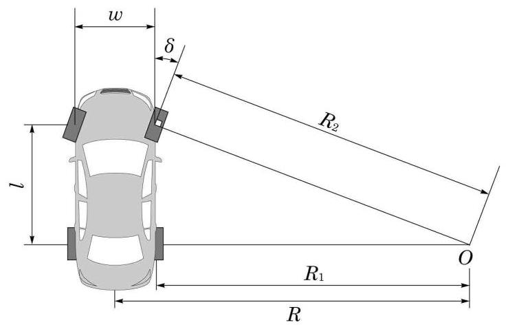
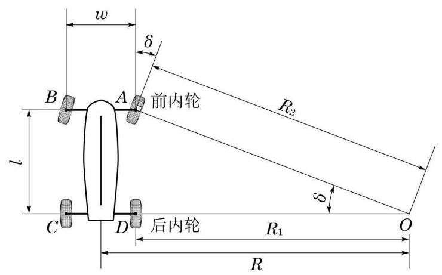

# 公式卡：建立模型

查阅资料，我们发现车辆转弯大都遵循阿克曼(Ackermann)转向几何原理. 依据阿克曼转向几何原理设计的车辆,沿着弯道转弯时,内侧轮的转向角比外侧轮要大 ${2}^{ \circ  } \sim  {4}^{ \circ  }$ , 四个轮子转弯路径的圆心大致交会于后轴延长线上的瞬时转向中心，让车辆可以顺畅地转弯 (图 3-1).

图 3-1 阿克曼转向几何原理

在现实生活中, 机动车辆一般有四个车轮, 分别是:前外轮、前内轮、后外轮、后内轮. 为了便于研究, 我们对问题作出如下假设:

假设 1: 车辆有两个前轮和两个后轮;

假设 2: 车辆四个车轮的中心形成一个矩形;

假设 3: 车辆在转弯时处于理想状态, 不产生侧滑;

假设 4: 车轮为刚性的, 转弯过程中不发生形变;

假设 5 :车轮的大小与厚度对内轮差没有影响；

假设 6 : 车辆转弯遵循阿克曼转向几何原理.

让我们先来看车辆分析图,如图 3-2 所示. 记车辆的转向中心为 $O$ . 设 $O$ 到两后轮中点的距离为 $R$ ,此即车辆的转弯半径. 又设两前轮之间距离 (称为轮距) 为 $w$ ,同侧前后两轮距离 (称为轴距) 为 $l$ ,车辆转弯时前内轮转角为 $\delta$ . 把 $O$ 到后内轮和前内轮的距离分别记为 ${R}_{1}$ 和 ${R}_{2}$ ,它们分别是后内轮和前内轮的转弯半径. 于是,我们要求的车辆转弯时的内轮差为 ${R}_{2} - {R}_{1}$ .

图 3-2 车辆分析图

图 3-3 车辆内部图

车辆转弯状态可以用前内轮转角 $\delta$ 或车辆转弯半径 $R$ 来描述. 这是两个(互相关联的) 参数. 我们分别用这两个参数建立模型.

模型 I 如图 3-3,记四个车轮的中心分别为 $A\text{ 、 }B\text{ 、 }C\text{ 、 }D$ . 容易得到, $\angle {AOC}$ 与前内轮转角 $\delta$ 相等. 于是

$$
\tan \delta  = \frac{l}{{R}_{1}},\sin \delta  = \frac{l}{{R}_{2}}.
$$

①

这样, 后内轮和前内轮的转弯半径分别为

$$
{R}_{1} = \frac{l}{\tan \delta },{R}_{2} = \frac{l}{\sin \delta }.
$$

②

车辆转弯时的内轮差为

$$
{R}_{\text{ 内轮差 }} = l\left( {\frac{1}{\sin \delta } - \frac{1}{\tan \delta }}\right)  = l\tan \frac{\delta }{2}.
$$

③

模型 II 现在用车辆的转弯半径 $R$ 作参数. 由于 $R = {R}_{1} + \frac{w}{2}$ ,我们可以用 ${R}_{1}$ 取代 $R$ 作参数. 从图 3-3 可以看出, ${R}_{2} = \sqrt{{l}^{2} + {R}_{1}^{2}}$ . 这样,我们得到内轮差模型

$$
{R}_{\text{ 内轮差 }} = \sqrt{{l}^{2} + {R}_{1}^{2}} - {R}_{1},
$$

④

或记为

$$
{R}_{\text{ 内轮差 }} = \frac{{l}^{2}}{\sqrt{{l}^{2} + {R}_{1}^{2}} + {R}_{1}}.
$$

⑤

参数 $\delta$ 与 ${R}_{1}$ 通过①式或②式相联系，用三角函数定义和半角公式容易验证，两个模型得到的内轮差公式是等价的.
