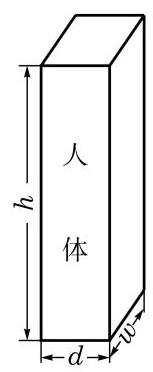
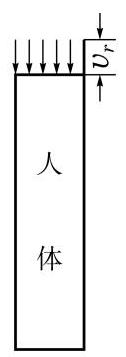
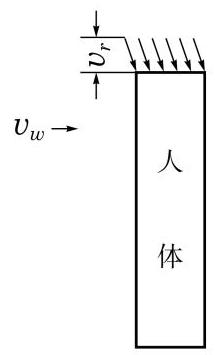
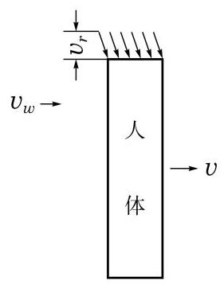

# 公式卡：初步模型

人在雨中行走，其头顶会被雨淋湿. 如图 4-1，记人的身高为 $h\left( \mathrm{\;m}\right)$ ，宽度为 $w\left( \mathrm{\;m}\right)$ ， 厚度为 $d\left( \mathrm{\;m}\right)$ ,则头顶被雨淋到的面积为

$$
{S}_{1} = {wd}\text{ . }
$$

①

用 $p$ 来度量雨滴的密度,称为降雨强度系数,它表示单位体积的空间中雨滴所占的比例. 又记降雨的速度为 ${v}_{r}\left( {\mathrm{\;m}/\mathrm{s}}\right)$ . 那么,如果人站着不动,在单位时间 $\left( {1\mathrm{\;s}}\right)$ 内,头顶的淋雨量就是头顶上方高度为 ${v}_{r}$ 的长方体中的雨滴量(图 4-2)，可表示为

$$
{C}_{h} = {pwd}{v}_{r}.
$$

②

通常, 降雨伴随着大风, 雨水不是垂直落下, 而是有一定的角度的. 这会对头顶的淋雨量产生影响吗?

如图 4-3,记水平风速为 ${v}_{w}\left( {\mathrm{\;m}/\mathrm{s}}\right)$ ,单位时间 $\left( {1\mathrm{\;s}}\right)$ 内落在头顶上的雨滴包含在一个倾斜的平行六面体中. 它的底面就是头顶,是一个长方形,面积为 ${wd}$ ; 它的高等于 ${v}_{r}$ . 根据平行六面体的体积公式，单位时间内头顶的淋雨量为

$$
{C}_{h} = {pwd}{v}_{r},
$$

这与无风情形下得到的单位时间淋雨量②式完全相同.

降雨时，人不会傻傻地站在雨中，而是想尽快跑至目的地，也就是说人处于运动当中. 记人在雨中的行走速度为 $v\left( {\mathrm{\;m}/\mathrm{s}}\right)$ (图 4-4),我们可以将人看成是固定不动的，那么风相对于人的运动速度大小就变为 $V = \left| {v - {v}_{w}}\right|$ . 根据上面的分析,风速的大小对单位时间内头顶的淋雨量没有影响，即淋雨量仍由②式给出. 这样，影响头顶淋雨量的因素就只剩下时间了. 记人在雨中行走的距离为 $D\left( \mathrm{\;m}\right)$ ，那么行走的时间为

$$
t = \frac{D}{v}
$$

③

从而头顶上总的淋雨量为

$$
{T}_{h} = \frac{{pwd}{v}_{r}D}{v}.
$$

④
