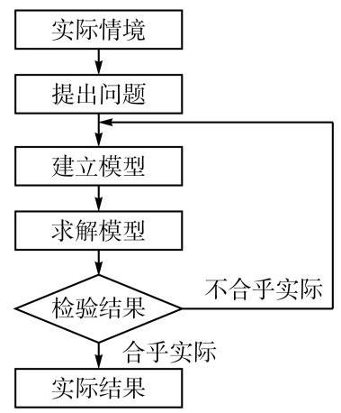

# 方法卡：什么是数学建模

每位同学自小学开始就一直与数学相伴. 从基本的四则运算到复杂的幂运算、对数运算, 从解方程到解不等式, 从算术、代数、平面几何到函数、三角、立体几何、解析几何和概率统计, 同学们的数学知识越来越丰富, 解题能力也越来越强, 相信大家已经有扎实的基础和充足的信心来迎接实际问题的挑战.

实际问题是如何呈现的呢? 同学们比较熟悉的可能是这样一类应用题: “甲、乙两人同时从山脚开始登山, 他们各自到达山顶后就立即下山. 假设甲比乙速度快, 而他们两人的下山速度都是各自上山速度的 $a$ 倍. 如果出发 $b$ 小时后,甲与乙在离山顶 $c$ 米处相遇, 而当乙到达山顶时，甲恰好下到半山腰. 问:甲回到出发点共用多少小时？”这类题目的提问直截了当, 已知条件明确充分, 解题要求清晰, 答案存在且唯一. 解答这类题目的主要目的是检查是否掌握了教材上的知识、技能或方法.

现实生活中, 与上述登山活动相关的情境可能是这样的: “某人计划登上一座名山的山顶, 但为安全考虑, 必须当天天黑以前返回山下驻地. 请选择一条比较合理的线路并规划具体往返时间, 并从数学角度说明这一规划的合理性. "这个问题和上述应用题有以下明显的不同:

(1)问题不够明确:什么是合理的线路？是时间最短、体力最省、景色最美，还是费用最省？

(2)条件并不完备:未给出天黑时间、步行速度、有哪些可选择的线路、每条线路的长度、上下山难度的差别、沿途是否有补给站等.

(3)细节尚需补充:景区是否有索道？如有，其开放时间、排队情况、所需费用等亦不明确.

(4)答案常常不唯一:以上要素将直接影响到问题的答案，对于不同的合理性标准、 不同的季节，答案往往是不同的.

(5)答案形式不同:应用题答案用一个确定的数往往就够了，而本问题的解答需要包括:合理性标准及其选择依据，各项条件如何确定，有无考虑索道等其他因素，以及线路和出发时间的确定过程等.

以上现实生活中的“登山问题”就可归结为一个数学建模问题.

一般来说, 数学建模 (mathematical modeling) 是对某个现实问题经过必要的简化、合理的假设得到一个数学问题, 称为数学模型 (mathematical model), 再求解所得到的数学问题, 然后根据实际情况验证该数学答案是否合理; 在合理性得不到保证时, 还要进行反复迭代和修正模型.

因此, 数学建模是一个建立数学模型的过程, 而数学模型是数学建模的一个结果. 数学建模的全过程一般包括在实际情境中从数学的视角发现问题、提出问题、分析问题、建立模型、求解模型得到答案、回到实际情境验证答案、如果答案不合理则加以改进等步骤, 如此循环直到实际情境中的问题得到合理的回答(图 0-1). 在本册教材中, 这个过程统称为数学建模活动.

图 0-1 数学建模活动过程图示
