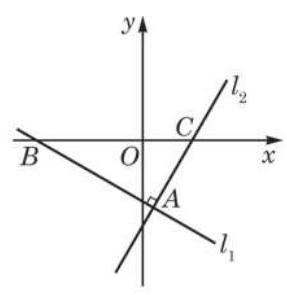
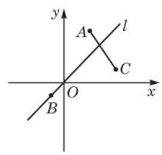

# 概念卡：A 组

(第 1 题)

1. 如图,在平面直角坐标系中,直线 ${l}_{1}$ 与 ${l}_{2}$ 垂直,垂足为 $A$ , ${l}_{1}\text{ 、 }{l}_{2}$ 与 $x$ 轴的交点分别为 $B\text{ 、 }C,\angle {ABC} = \frac{\pi }{6}$ . 试分别求直线 ${l}_{1}$ 、 ${l}_{2}$ 的倾斜角和斜率.

2. 求经过下列两点的直线的斜率与倾斜角:

(1) $P\left( {1,2}\right)$ 、 $Q\left( {2, - 1}\right)$ ；

(2) $M\left( {2,1}\right)$ 、 $N\left( {a, - 2}\right)$ ，其中实数 $a$ 是常数.

3. 根据下列直线 $l$ 的倾斜角 $\theta$ 的取值范围,计算斜率 $k$ 的取值范围:

(1) $\theta  \in  \left\lbrack  {\frac{\pi }{4},\frac{\pi }{3}}\right\rbrack$ ；

(第 5 题)

(2) $\theta  \in  \left( {\frac{\pi }{2},\frac{2\pi }{3}}\right)$ .

4. 已知三个不同的点 $A\left( {2, a}\right) \text{ 、 }B\left( {a + 1,{2a} + 1}\right) \text{ 、 }C\left( {-4,1 + a}\right)$ 在同一条直线上,求实数 $a$ 的值及该直线的斜率.

5. 如图,已知点 $A\left( {2,4}\right) \text{ 、 }B\left( {-1, - 1}\right) \text{ 、 }C\left( {4,1}\right)$ ,过点 $B$ 的直线 $l$ 与线段 ${AC}$ 相交. 求直线 $l$ 的斜率 $k$ 的取值范围.
