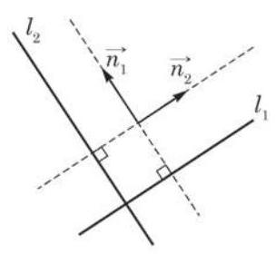

# 概念卡：2 两条直线垂直的判定与夹角的求法

我们已经知道, 平面上两条相交直线交得的锐角或直角叫做这两条直线的夹角. 当两条直线的夹角为直角时, 称这两条直线垂直.

在平面直角坐标系中, 给定两条相交的直线

$$
{l}_{1} : {a}_{1}x + {b}_{1}y + {c}_{1} = 0\left( {{a}_{1}\text{ 、 }{b}_{1}\text{ 不同时为零 }}\right) ,
$$

$$
{l}_{2} : {a}_{2}x + {b}_{2}y + {c}_{2} = 0\left( {{a}_{2}\text{ 、 }{b}_{2}\text{ 不同时为零 }}\right) .
$$

如何根据方程判定两条直线是否垂直呢?

我们知道, $\overrightarrow{{n}_{1}} = \left( {{a}_{1},{b}_{1}}\right)$ 与 $\overrightarrow{{n}_{2}} = \left( {{a}_{2},{b}_{2}}\right)$ 分别是直线 ${l}_{1}$ 与 ${l}_{2}$ 的法向量. 由于直线与其法向量所在直线垂直 (图 1-3-1), 因此 ${l}_{1} \bot  {l}_{2} \Leftrightarrow  \overrightarrow{{n}_{1}} \bot  \overrightarrow{{n}_{2}}$ ，再由必修课程 8.3 节的向量垂直的充要条件 $\overrightarrow{{n}_{1}} \bot  \overrightarrow{{n}_{2}} \Leftrightarrow  {a}_{1}{a}_{2} + {b}_{1}{b}_{2} = 0$ ，我们得到

$$
{l}_{1} \bot  {l}_{2} \Leftrightarrow  {a}_{1}{a}_{2} + {b}_{1}{b}_{2} = 0.
$$

特别地,当 ${b}_{1}{b}_{2} \neq  0$ 时,直线 ${l}_{1}$ 与 ${l}_{2}$ 的斜率都存在,分别为 ${k}_{1} =  - \frac{{a}_{1}}{{b}_{1}}$ 与 ${k}_{2} =  - \frac{{a}_{2}}{{b}_{2}}$ ,条件 ${a}_{1}{a}_{2} + {b}_{1}{b}_{2} = 0$ 可以改写为 $\frac{{a}_{1}}{{b}_{1}} \cdot  \frac{{a}_{2}}{{b}_{2}} =$ -1 , 即 ${k}_{1}{k}_{2} =  - 1$ . 于是

$$
{l}_{1} \bot  {l}_{2} \Leftrightarrow  {k}_{1}{k}_{2} =  - 1.
$$
