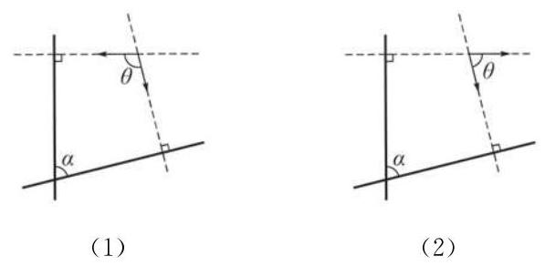

# 练习卡：练习 1.3(2)

1. 已知直线 ${l}_{1} : \left( {a - 2}\right) x + {ay} - 2 = 0$ 与 ${l}_{2} : \left( {1 - a}\right) x + \left( {a + 1}\right) y + 1 = 0$ 互相垂直， 求实数 $a$ 的值.

2. 求过点 $\left( {-1, - 1}\right)$ 且分别与下列直线垂直的直线方程:

(1) $y = 2$ ；

(2) $y = x$ ；

(3) ${2x} + y + 2 = 0$ ；

(4) $x\cos \theta  + y\sin \theta  = 1$ ， $\theta$ 为给定的实数.

如果 ${l}_{1} : {a}_{1}x + {b}_{1}y + {c}_{1} = 0$ 与 ${l}_{2} : {a}_{2}x + {b}_{2}y + {c}_{2} = 0$ 是给定的两条相交直线,我们该如何求出它们的夹角 $\alpha$ 呢?

根据必修课程 8.3 节的向量夹角的余弦公式, 我们立即可以得到 ${l}_{1}$ 与 ${l}_{2}$ 的法向量 $\overrightarrow{{n}_{1}} = \left( {{a}_{1},{b}_{1}}\right)$ 与 $\overrightarrow{{n}_{2}} = \left( {{a}_{2},{b}_{2}}\right)$ 的夹角 $\theta$ 的余弦

$$
\cos \theta  = \frac{{a}_{1}{a}_{2} + {b}_{1}{b}_{2}}{\sqrt{{a}_{1}^{2} + {b}_{1}^{2}}\sqrt{{a}_{2}^{2} + {b}_{2}^{2}}}.
$$

因此，只要理清角 $\theta$ 与角 $\alpha$ 的关系，就能得出角 $\alpha$ 的余弦公式.

如图 1-3-2,设两条直线 (实线所示) 的夹角为 $\alpha$ ,不妨从夹角内部的一点分别作两条直线的一个法向量,法向量夹角为 $\theta$ . 两个法向量所在直线 (虚线所示) 和原来的两条直线围成了一个四边形,其中一组对角均是直角,另外一组对角是 $\alpha$ 与 $\theta$ 或者 $\alpha$ 与 $\pi  - \theta$ . 由此可见 $\alpha  + \theta  = \pi$ 或者 $\alpha  + \left( {\pi  - \theta }\right)  = \pi$ ,推出 $\alpha  = \pi  - \theta$ 或者 $\alpha  = \theta$ . 这样, $\cos \alpha  =  \pm  \cos \theta$ . 因为 $0 < \alpha  \leq  \frac{\pi }{2},\cos \alpha  \geq  0$ ,所以 $\cos \alpha  = \left| {\cos \theta }\right|$ .

把这个一般的讨论用于直线 ${l}_{1}$ 与 ${l}_{2}$ 的情况,则 ${l}_{1} : {a}_{1}x + \; {b}_{1}y + {c}_{1} = 0$ 与 ${l}_{2} : {a}_{2}x + {b}_{2}y + {c}_{2} = 0$ 的夹角 $\alpha$ 的余弦公式为

$$
\cos \alpha  = \frac{\left| {a}_{1}{a}_{2} + {b}_{1}{b}_{2}\right| }{\sqrt{{a}_{1}^{2} + {b}_{1}^{2}}\sqrt{{a}_{2}^{2} + {b}_{2}^{2}}}.
$$
