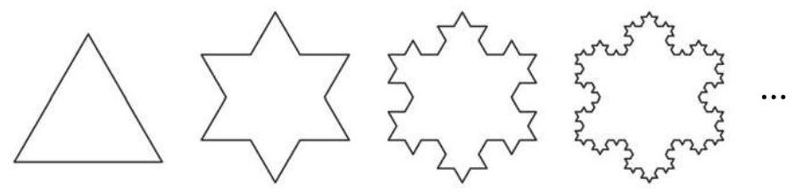

# 公式卡：1 等比数列及其通项公式

观察以下数列, 看这些数列有什么共同特点.

(1)-1 的 1 次幂、2 次幂、3 次幂、4 次幂……依次为

$$
- 1,1, - 1,1,\cdots \text{ . }
$$

①

(2)科克雪花曲线. 即将一个边长为 1 的等边三角形的每条边三等分, 以中间一段为边向外作等边三角形, 并擦去中间一段, 如图 4-2-1, 如此继续下去得到图形的每条边的长度依次为

$$
1,\frac{1}{3},\frac{1}{9},\frac{1}{27},\cdots
$$

②

(3)图 4-2-1 中的每个图形的边数依次为

$$
3,{12},{48},{192},\cdots \text{ . }
$$

③

可以看到, 对于数列①, 从第 2 项起, 每一项与其前一项的比都等于 -1 ; 对于数列②, 从第 2 项起, 每一项与其前一项的比都等于 $\frac{1}{3}$ ; 对于数列③,从第 2 项起,每一项与其前一项的比都等于 4 .

这些数列有一个共同特点: 从第 2 项起, 每一项与其前一项的比都等于同一个常数.

定义 如果一个数列从第 2 项起, 每一项与其前一项的比都等于同一个非零常数, 这个数列就叫做等比数列 (geometric sequence), 而这个常数叫做等比数列的公比(common ratio). 公比通常用小写字母 $q\left( {q \neq  0}\right)$ 表示.

---

既是等差数列又是等比数列的数列存在吗? 如果存在, 你能举出例子吗?

---

在两个非零实数 $a$ 与 $b$ 中间插入一个数 $G$ ,使 $a, G, b$ 成等比数列. 根据等比数列的定义,有 $\frac{G}{a} = \frac{b}{G}$ ,从而 ${G}^{2} = {ab}$ ,即 $G = \sqrt{ab}$ 或 $G =  - \sqrt{ab}$ . 这两种情形下, $a, G, b$ 均为等比数列. 此时, $G$ 叫做 $a$ 与 $b$ 的等比中项.

根据等比数列的定义,以 ${a}_{1}$ 为首项、以 $q$ 为公比的等比数列 $\left\{  {a}_{n}\right\}$ 满足 $\frac{{a}_{n}}{{a}_{n - 1}} = q\left( {n \geq  2}\right)$ . 因此,当 $n \geq  2$ 时,有

$$
\frac{{a}_{2}}{{a}_{1}} = q,\frac{{a}_{3}}{{a}_{2}} = q,\frac{{a}_{4}}{{a}_{3}} = q,\cdots ,\frac{{a}_{n}}{{a}_{n - 1}} = q.
$$

由此可得, $\frac{{a}_{n}}{{a}_{1}} = {q}^{n - 1}$ . 所以, ${a}_{n} = {a}_{1}{q}^{n - 1}\left( {n \geq  2}\right)$ . 而当 $n = 1$ 时,上面的等式也显然成立.

因此,当 $n$ 为正整数时,等比数列 $\left\{  {a}_{n}\right\}$ 的第 $n$ 项可表示为

$$
{a}_{n} = {a}_{1}{q}^{n - 1}.
$$

这称为等比数列 $\left\{  {a}_{n}\right\}$ 的通项公式.
