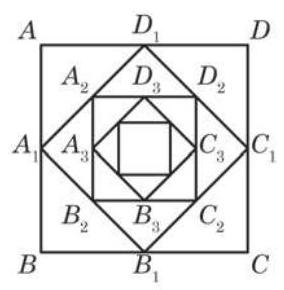

# 例题卡：例 8 如图 4-2-2,正方形 ${ABCD}$ 的边长等于 1,连接这个正方形各边的中点得到一个小正方形 ${A}_{1}{B}_{1}{C}_{1}{D}_{1}$ ; 又连接正方形 ${A}_{1}{B}_{1}{C}_{1}{D}_{1}$ 各边的中点得到一个更小的正方形 ${A}_{2}{B}_{2}{C}_{2}{D}_{2}$ ; 如此无限继续下去. 求所有这些正方形的周长的和与面积的和.

例 8 如图 4-2-2,正方形 ${ABCD}$ 的边长等于 1,连接这个正方形各边的中点得到一个小正方形 ${A}_{1}{B}_{1}{C}_{1}{D}_{1}$ ; 又连接正方形 ${A}_{1}{B}_{1}{C}_{1}{D}_{1}$ 各边的中点得到一个更小的正方形 ${A}_{2}{B}_{2}{C}_{2}{D}_{2}$ ; 如此无限继续下去. 求所有这些正方形的周长的和与面积的和.

$$
{0.4}\dot{3}\dot{1} = {0.4} + \frac{0.031}{1 - {0.01}} = \frac{4}{10} + \frac{31}{990} = \frac{427}{990}.
$$

解 由题设,可得到第 1 个正方形的边长 ${a}_{1} = 1$ ,第 2 个

正方形的边长 ${a}_{2} = \frac{\sqrt{2}}{2},\cdots \cdots$ ,第 $n$ 个正方形的边长 ${a}_{n} = \; \sqrt{{\left( \frac{{a}_{n - 1}}{2}\right) }^{2} + {\left( \frac{{a}_{n - 1}}{2}\right) }^{2}} = \frac{\sqrt{2}{a}_{n - 1}}{2}\left( {n \geq  2}\right) .$

所有这些正方形的边长组成的数列为

$$
1,\frac{\sqrt{2}}{2},\frac{1}{2},\frac{\sqrt{2}}{4},\cdots ,{\left( \frac{\sqrt{2}}{2}\right) }^{n - 1},\cdots ,
$$

从而所有这些正方形的周长组成的数列为

$$
4,2\sqrt{2},2,\sqrt{2},\cdots ,4 \cdot  {\left( \frac{\sqrt{2}}{2}\right) }^{n - 1},\cdots .
$$

这是一个以 4 为首项、以 $\frac{\sqrt{2}}{2}$ 为公比的等比数列,因此所有这些正方形的周长的和为

$$
\mathop{\sum }\limits_{{i = 1}}^{{+\infty }}4 \cdot  {\left( \frac{\sqrt{2}}{2}\right) }^{i - 1} = \frac{4}{1 - \frac{\sqrt{2}}{2}} = 8 + 4\sqrt{2}.
$$

所有这些正方形的面积组成的数列为

$$
1,\frac{1}{2},\frac{1}{4},\frac{1}{8},\cdots ,{\left( \frac{1}{2}\right) }^{n - 1},\cdots .
$$

这是以 1 为首项、以 $\frac{1}{2}$ 为公比的等比数列,因此所有这些正方形的面积的和为

$$
\mathop{\sum }\limits_{{i = 1}}^{{+\infty }}{\left( \frac{1}{2}\right) }^{i - 1} = \frac{1}{1 - \frac{1}{2}} = 2.
$$
