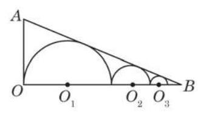

# 公式卡：习题 4.2

##### A 组

1. 求下列各组数的等比中项:

(1) $\sqrt{3} + 1$ 与 $\sqrt{3} - 1$ ；

(2) ${a}^{4} + {a}^{2}{b}^{2}$ 与 ${b}^{4} + {a}^{2}{b}^{2}\left( {a \neq  0, b \neq  0}\right)$ .

2. 设数列 $\left\{  {a}_{n}\right\}$ 为等比数列,其公比为 $q$ .

(1)已知 ${a}_{5} = 8,{a}_{8} = 1$ ,求 ${a}_{1}\text{ 、 }q$ ;

(2)已知 ${a}_{3} = 2, q =  - 1$ ，求 ${a}_{15}$ ；

(3)已知 ${a}_{4} = {12},{a}_{8} = 6$ ，求 ${a}_{12}$ .

3. 已知数列 $\left\{  {a}_{n}\right\}$ 为等比数列,其公比为 $q$ . 判断下列数列是否为等比数列. 如果是, 求其公比; 如果不是, 请说明理由.

(1)数列 $\left\{  {2{a}_{n}}\right\}$ ；

(2)数列 $\left\{  {{a}_{n} + {a}_{n + 1}}\right\}$ .

4. 已知数列 $\left\{  {a}_{n}\right\}$ 和数列 $\left\{  {b}_{n}\right\}$ 为项数相同的等比数列,公比分别为 ${q}_{1}$ 和 ${q}_{2}$ . 求证: 数列 $\left\{  {{a}_{n}{b}_{n}}\right\}$ 为等比数列,其公比为 ${q}_{1}{q}_{2}$ .

5. 已知直角三角形的斜边长为 $c$ ,两条直角边长分别为 $a$ 和 $b\left( {a < b}\right)$ ,且 $a, b, c$ 成等比数列. 求 $a : c$ 的值.

6. 某产品经过 4 次革新后, 成本由原来的 105 元下降到 60 元. 如果这种产品每次革新后成本下降的百分比相同,那么每次革新后成本下降的百分比是多少? (结果精确到 0.1%)

7. 设数列 $\left\{  {a}_{n}\right\}$ 为等比数列,其公比为 $q$ ,前 $n$ 项和为 ${S}_{n}$ .

(1)已知 ${a}_{1} = 5, q = 3$ ，求 ${S}_{5}$ ；

(2)已知 ${a}_{8} = \frac{1}{16}, q = \frac{1}{2}$ ，求 ${S}_{8}$ ；

(3)已知 ${a}_{1} =  - 2, q =  - \frac{1}{2},{a}_{n} = \frac{1}{1024}$ ,求 ${S}_{n}$ ;

(4)已知 ${S}_{6} = \frac{189}{4}, q = \frac{1}{2}$ ,求 ${a}_{1}$ .

8. 设等比数列 $\left\{  {a}_{n}\right\}$ 的公比 $q < 1$ ,前 $n$ 项和为 ${S}_{n}$ . 已知 ${a}_{3} = 2,{S}_{4} = 5{S}_{2}$ ,求数列 $\left\{  {a}_{n}\right\}$ 的通项公式.

9. 一个球从 ${100}\mathrm{\;m}$ 高处自由落下,假设每次着地后又跳回到原高度的一半再落下.

(1)当它第 10 次着地时,求它经过的总路程;

(2)它可能在某次着地时，经过的总路程超过 ${300}\mathrm{\;m}$ 吗？如果可能，请说明是第几次着地首次超过 ${300}\mathrm{\;m}$ ；如果不可能，请说明理由.

##### B 组

1. 已知 $b$ 是 $a$ 与 $c$ 的等比中项,且 $a\text{ 、 }b\text{ 、 }c$ 同号. 求证: $\frac{a + b + c}{3},\sqrt{\frac{{ab} + {bc} + {ca}}{3}}$ , $\sqrt[3]{abc}$ 成等比数列.

2. 已知 $a \neq  b$ ,且 $a\text{ 、 }b$ 都不为 0 . 设 $n$ 为正整数,写出 $\mathop{\sum }\limits_{{i = 0}}^{n}{a}^{n - i}{b}^{i}$ 的具体展开式,并证明 $\mathop{\sum }\limits_{{i = 0}}^{n}{a}^{n - i}{b}^{i} = \frac{{a}^{n + 1} - {b}^{n + 1}}{a - b}$ .

3. 已知对任意给定的正整数 $n$ ,数列 $\left\{  {a}_{n}\right\}$ 的前 $n$ 项和 ${S}_{n} = \frac{1 - {q}^{n}}{1 - q}\left( {q \neq  0\text{ 且 }q \neq  1}\right)$ . 判断 $\left\{  {a}_{n}\right\}$ 是否为等比数列,并说明理由.

4. 已知数列 $\left\{  {a}_{n}\right\}$ 为等差数列,数列 $\left\{  {b}_{n}\right\}$ 满足 ${b}_{n} = {\left( \frac{1}{2}\right) }^{{a}_{n}}$ ( $n$ 为正整数).

(1)求证:数列 $\left\{  {b}_{n}\right\}$ 为等比数列；

(2)若 ${b}_{1} + {b}_{2} + {b}_{3} = \frac{21}{8},{b}_{1}{b}_{2}{b}_{3} = \frac{1}{8}$ ，求数列 $\left\{  {a}_{n}\right\}$ 的通项公式.

5. 如图,已知直角三角形 ${AOB}$ 的两条直角边 ${AO}$ 和 ${BO}$ 的长分别为 5 和 12,点 ${O}_{1}\text{ 、 }{O}_{2}\text{ 、 }\cdots \text{ 、 }{O}_{n}\text{ 、 }\cdots$ 在边 ${OB}$ 上,半圆 ${O}_{1}$ 与 ${AO}$ 和 ${AB}$ 所在直线均相切,半圆 ${O}_{2}\text{ 、 }{O}_{3}\text{ 、 }\cdots \text{ 、 }{O}_{n}\text{ 、 }\cdots$ 与 ${AB}$ 所在直线相切,且与半圆 ${O}_{1}\text{ 、 }{O}_{2}\text{ 、 }\cdots \text{ 、 }{O}_{n - 1}\text{ 、 }\cdots$ 分别外切. 设这些半圆的半径分别为 ${r}_{1}\text{ 、 }{r}_{2}\text{ 、 }\cdots \text{ 、 }{r}_{n}\text{ 、 }\cdots$ .

(第 5 题)

(1)求证:数列 $\left\{  {r}_{n}\right\}$ 为等比数列；

(2)求前 $n$ 个半圆弧长的总和 ${L}_{n}$ ；

(3)利用前 $n$ 个半圆弧长的总和 ${L}_{n}$ 的表达式,计算 $\mathop{\lim }\limits_{{n \rightarrow   + \infty }}{L}_{n}$ .
