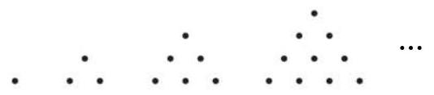
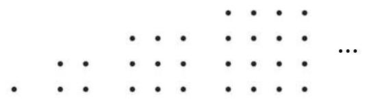

# 公式卡：1 数列的概念与性质

除了我们前面学过的等差数列、等比数列这两类特殊的数列外, 在现实世界中, 许多事物的数量也可以排成一列数.

(1)如图 4-3-1，能够表示成三角形点阵的点数依次为

$$
1,3,6,{10},{15},{21},{28},\cdots \text{ . }
$$

①

(2)如图 4-3-2，能够表示成正方形点阵的点数依次为

$$
1,4,9,{16},{25},\cdots \text{ . }
$$

②

(3)目前通用的第五套人民币纸币的面额(单位:元)按照从大到小的顺序排列依次为

$$
{100},{50},{20},{10},5,1.
$$

③

(4)医生要对病人的体温进行 24 小时监控，某天从 0 时开始记录，每隔 4 小时记录一次，共记录 7 次，监测到病人的体温 (单位:℃)依次为

$$
{39.2},{38.3},{37.5},{37.0},{36.8},{37.2},{37.6}\text{ . }
$$

④

(5)将 $\sqrt{2}$ 的不足近似值按小数位数从少到多的顺序排列依次为

$$
1,{1.4},{1.41},{1.414},{1.4142},{1.41421},\cdots \text{ . }
$$

⑤

像这样, 按照一定顺序排列的一列数称为一个数列 (number sequence). 数列与以往学过的数集相比, 有下述不同点: 集合中的元素是无序的, 而数列的项必须按一定顺序排列, 即为有序的; 此外, 集合中的元素要求互异, 而数列的项可以是相同的.

---

$\sqrt{2}$ 的不足近似值: 按照所需要的精确度截取指定数位后, 直接略去后面的数位, 就得到了一个小于 $\sqrt{2}$ 的近似值,称为 $\sqrt{2}$ 的不足近似值.

---

给定一个数列 $\left\{  {a}_{n}\right\}$ ,当项的序数 $n$ 确定时,相应的项 ${a}_{n}$ 也就确定了. 于是,项 ${a}_{n}$ 与项的序数 $n$ 之间存在着对应关系,这种对应关系可描述如下

$$
\text{ 项的序数 }1,2,3,4,\cdots , n,\cdots \text{ . }
$$

$\downarrow   \downarrow   \downarrow   \downarrow   \downarrow$

项 ${a}_{1},{a}_{2},{a}_{3},{a}_{4},\cdots ,{a}_{n},\cdots$ .

项数有限的数列叫做有穷数列 (finite sequence); 项数无限的数列叫做无穷数列 (infinite sequence). 从第 2 项起, 每一项都不小于其前一项的数列 $\left\{  {a}_{n}\right\}$ 叫做增数列,此时 ${a}_{n + 1} \geq  {a}_{n}$ ( $n$ 为正整数)成立. 特别地，从第 2 项起, 每一项都大于其前一项的数列 $\left\{  {a}_{n}\right\}$ 叫做严格增数列,此时 ${a}_{n + 1} > {a}_{n}$ ( $n$ 为正整数) 成立. 相应地,从第 2 项起,每一项都不大于其前一项的数列 $\left\{  {a}_{n}\right\}$ 叫做减数列,此时 ${a}_{n + 1} \leq  {a}_{n}$ ( $n$ 为正整数) 成立. 特别地,从第 2 项起,每一项都小于其前一项的数列 $\left\{  {a}_{n}\right\}$ 叫做严格减数列,此时 ${a}_{n + 1} < {a}_{n}$ ( $n$ 为正整数) 成立. 增数列和减数列统称为单调数列. 各项均相等的数列叫做常数列.

给定数列 $\left\{  {a}_{n}\right\}$ ,如果可以用一个关于序数 $n$ 的公式来表示数列中的任一项 ${a}_{n}$ ,那么这个公式就称为数列 $\left\{  {a}_{n}\right\}$ 的通项公式 (general term). 有了数列的通项公式, 就可以算出数列中的各项.

实际中, 也常用列表法来表示数列. 例如, 对于数列④, 我们可以用下表直观地表示:

表 4-1
