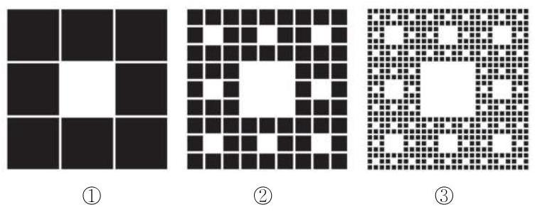

# 公式卡：习题 4.3

##### A 组

1. 已知下列数列 $\left\{  {a}_{n}\right\}$ 的通项公式,写出它的前 4 项.

(1) ${a}_{n} = {n}^{2} - {5n}$ ； (2) ${a}_{n} = \frac{\cos {n\pi }}{2}$ .

2. 已知数列 $\left\{  {a}_{n}\right\}$ 的通项公式为 ${a}_{n} = \frac{{n}^{2} + n - 1}{3}$ ，79 $\frac{2}{3}$ 是否是该数列中的项？若是，是第几项?

3. 已知数列 $\left\{  {a}_{n}\right\}$ 的通项公式为 ${a}_{n} = {n}^{2} - {8n} + 5$ .

(1)写出这个数列的前 5 项;

(2)这个数列有没有最小项？如果有，是第几项？

4. 已知数列 $\left\{  {a}_{n}\right\}$ 的通项公式为 ${a}_{n} = \left( {{3n} - 2}\right) {\left( \frac{3}{5}\right) }^{n}$ ,试问: 该数列是否有最大项、最小项? 若有, 分别指出第几项最大、最小; 若没有, 试说明理由.

5. 已知数列 $\left\{  {a}_{n}\right\}$ 的首项 ${a}_{1} = 1$ ,且 ${a}_{n} = {2}^{n - 1} \cdot  {a}_{n - 1}\left( {n \geq  2}\right)$ . 求数列 $\left\{  {a}_{n}\right\}$ 的通项公式.

6. 已知数列 $\left\{  {a}_{n}\right\}$ 满足 ${a}_{1} = {33}$ ,且 ${a}_{n} - {a}_{n - 1} = 2\left( {n - 1}\right) \left( {n \geq  2}\right)$ . 求数列 $\left\{  \frac{{a}_{n}}{n}\right\}$ 的最小项.

7. 一个正方形被等分成九个相等的小正方形,将最中间的一个正方形挖掉,得图①; 再将剩下的每个正方形都分成九个相等的小正方形, 并将其最中间的一个正方形挖掉, 得图②; 如此继续下去……

(1)图③中共挖掉了多少个正方形？

(2)求每次挖掉的正方形个数所构成的数列的一个递推公式.

(第 7 题)

##### B 组

1. 已知数列 $\left\{  {a}_{n}\right\}$ 的通项公式为 ${a}_{n} = \frac{n - \sqrt{97}}{n - \sqrt{98}}$ ,试问: 该数列是否有最大项、最小项? 若有, 分别指出第几项最大、最小; 若没有, 试说明理由.

2. 已知数列 $\left\{  {a}_{n}\right\}$ 的通项公式为 ${a}_{n} = {n}^{2} + {\lambda n}$ ,其中 $\lambda$ 是常数. 若数列 $\left\{  {a}_{n}\right\}$ 为严格增数列,求 $\lambda$ 的取值范围.

3. 已知数列 $\left\{  {a}_{n}\right\}$ 的前 $n$ 项和为 ${S}_{n}$ ,且 ${a}_{1} = 1,{a}_{n + 1} = 2{S}_{n}\left( {n\text{ 为正整数 }}\right)$ . 求数列 $\left\{  {a}_{n}\right\}$ 的通项公式.

4. 已知数列 $\left\{  {a}_{n}\right\}$ 的前 $n$ 项和为 ${S}_{n} = {12} - {12} \cdot  {\left( \frac{2}{3}\right) }^{n}$ .

(1)求数列 $\left\{  {a}_{n}\right\}$ 的通项公式；

(2)若数列 $\left\{  {b}_{n}\right\}$ 满足 ${b}_{n} = \left( {{2n} - 1}\right) {a}_{n}$ ，间是否存在正整数 $m$ ，使得 ${b}_{m} \geq  9$ 成立，并说明理由.

5. 某皮革厂第 1 年初有资金 1000 万元，由于引进了先进的生产设备，资金年平均增长率可达到 50%. 每年年底定额扣除下一年的消费基金后, 将剩余资金投入再生产. 这家皮革厂每年应扣除多少消费基金, 才能实现资金在第 5 年年底扣除消费基金后达到 2000 万元的目标?(结果精确到 1 万元)
