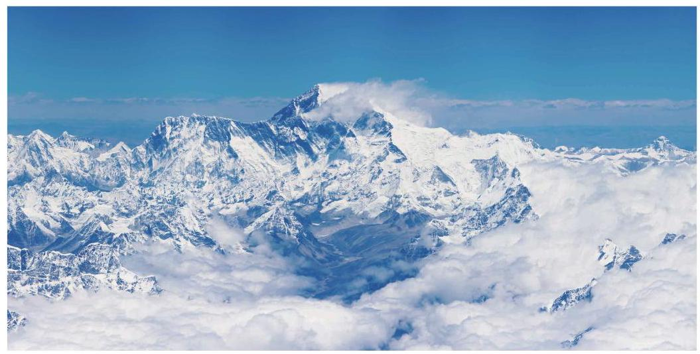

# 概念卡：3 珠穆朗玛峰顶上有多少氧气

作为世界海拔最高的山峰, 珠穆朗玛峰一直以来吸引着众多的登山爱好者. 根据 2020 年的最新测量结果,珠峰顶部海拔高度为 ${8848.86}\mathrm{\;m}$ . 珠峰顶上的氧气含量是否低于人类生命所能承受的极限？

在海拔高度为 $0\mathrm{\;m}$ 的海平面,大气压 $P = {101.325}\mathrm{{kPa}}$ (千帕). 在 ${0}^{ \circ }\mathrm{C}$ 的干燥空气中, 氧气的含量 (以体积比计算) 为 20.95%，因此大气压中由氧气施加的压强(称为氧分压)为 101.325×20.95%＝21.228 kPa. 当然，这些数值都是在理想状态下得到的，当状态改变时, 数据就会发生变化. 例如, 当空气中存在水分时, 水蒸气产生的压强就会占据大气压的部分比例; 当温度变化时, 大气压也会变化. 但我们将忽略这些因素, 聚焦于不同海拔高度上的大气压和它的氧分压.

随着海拔高度的上升, 大气压会逐步下降. 然而, 一个基本的事实是: 在任何海拔高度上,氧气在空气中的占比始终维持在 20.95% 的水平. 也就是说,海拔升高并不意味着空气中氧气含量的比例降低. 但是由于大气压的降低, 它的氧分压也会降低, 因此空气中所含氧气的绝对量要减少. 为了形象地描述此时空气中所含氧气的情况, 人们引进了不同海拔高度上的含氧量的概念, 它是把一个海拔高度上大气压中的氧分压除以海平面的大气压所得到的商 (用百分比表达). 例如,某地大气压为 89.234kPa,则氧分压为 89.234 X 20.95%=18.69 (kPa),而此地的含氧量则是 ${18.69} \div {101.325} = {18.45}\%$ . 注意,这不是说此地空气中只含 18.45% 的氧气,而是指此地空气中所含氧气如果放到压强为 101.325 kPa 的大气中，其所占的比例为 18.45%. 把上面的计算过程进行推广，就得出了一个地区含氧量 $O$ 与大气压 $P$ (以 $\mathrm{{kPa}}$ 为单位) 的关系式

$$
O = \frac{P}{101.325} \times {20.95}\% = P \times {0.20676}\% .
$$

①

长期生活在低海拔地区的人们，到了高海拔的地区，由于大气压降低、含氧量减少，身体可能会产生不适反应，这就是日常所说的高原反应.
