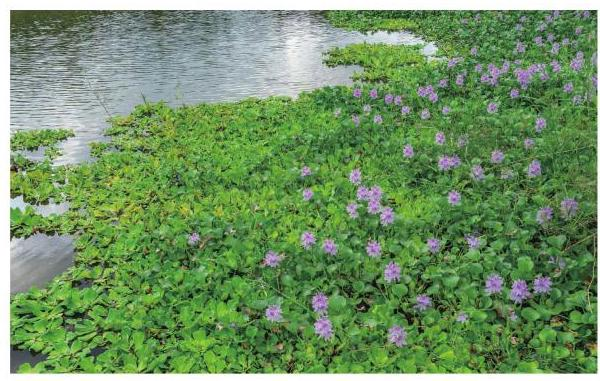

# 概念卡：4 水葫芦的生长

在一些河道丰富的地区, 我们常常会发现, 一段时间内有一种绿色植物覆盖一大片, 甚至是整个河面. 这是一种名为水葫芦的植物, 它的学名叫做凤眼莲.

1884 年, 在美国新奥尔良国际博览会上, 原产于南美洲的水葫芦艳丽无比, 人们于是将其作为观赏植物带回了各自的国家. 1901 年, 水葫芦被作为观赏植物引入中国.

随着水葫芦的引入，人们逐渐发现，在适宜的环境下它的繁殖能力极强. 据观察，在三个月的时间内，水葫芦可以由一株繁殖到数十万株. 由于水葫芦在自然界没有天敌，这样超强的繁殖力很容易对环境、水上交通、人畜饮水安全、渔业生产造成不良的影响，形成季节性灾难. 那么，水葫芦的繁殖能力究竟有多强呢？

你对水葫芦有哪些认识？请填入下框.
