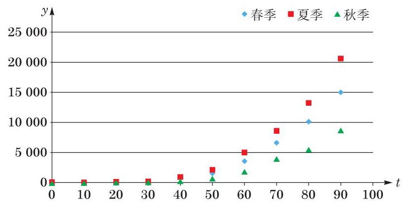
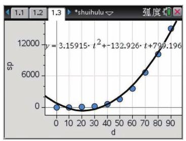
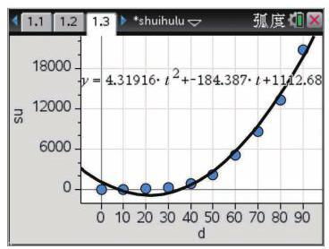
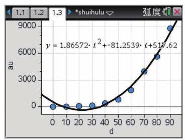

# 方法卡：求解模型

接下来的任务就是要找出合适的关系函数 $f$ ,以呈现植物量与生长时间的关联.

在探索两个变量之间的关系时, 我们可以使用如下方法:

(1)使用描点法绘制散点图，观察变量之间的关系；

(2)使用相关分析，考察变量之间是否存在线性关系.

根据表 4-1 中的数据,用描点法绘制植物量 $y$ 关于时间 $t$ 的散点图 (图 4-1),以便考察 $y$ 与 $t$ 之间的变化关系.

由图 4-1, 水葫芦的植物量与时间呈现出某种函数关系. 请仔细观察, 据此猜测水葫芦的植物量 $y$ 关于时间 $t$ 可能满足哪种函数关系,并将你的猜测填入下框.

经过观察，你可能会发现:

(1)水葫芦的植物量 $y$ 与时间 $t$ 具有某种曲线关系，而非用直线表示的一次函数关系;

(2)水葫芦的植物量 $y$ 与时间 $t$ 呈现出某种二次函数的关系；

(3)水葫芦的植物量 $y$ 与时间 $t$ 呈现出某种指数函数的关系.

如果水葫芦的植物量 $y$ 与时间 $t$ 确实存在某种二次函数关系,那么我们可以将这一函数关系表示为 $y = k + {mt} + n{t}^{2}$ ,其中 $k\text{ 、 }m\text{ 、 }n$ 是待定的系数.

利用图形计算器或电脑软件，我们可以据此分别得到水葫芦在春季、夏季、秋季的生长函数, 即相应的生长模型:

春季: $y = {799.196} - {132.926t} + {3.15915}{t}^{2}$ ,如图 4-2 所示;

夏季: $y = {1112.68} - {184.387t} + {4.31916}{t}^{2}$ ,如图 4-3 所示;

秋季: $y = {517.62} - {81.2539t} + {1.86572}{t}^{2}$ ,如图 4-4 所示.

